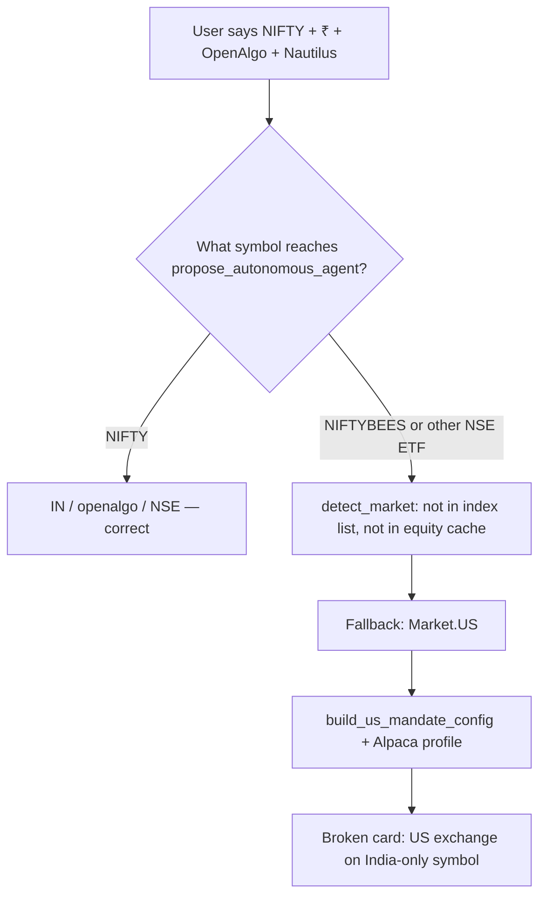

# Autonomous Agent Market Routing Fix

> **For agentic workers:** REQUIRED SUB-SKILL: Use superpowers:subagent-driven-development (recommended) or superpowers:executing-plans to implement this plan task-by-task. Steps use checkbox (`- [ ]`) syntax for tracking.

**Goal:** Ensure autonomous agent creation routes Indian symbols (NIFTY, BANKNIFTY, NSE equities/ETFs) to the India stack (Nautilus + OpenAlgo) and US symbols to Alpaca — using symbol registry, user context, and validation — so proposal cards never show `execution_market: US` for an India-only instrument.

**Architecture:** Introduce a single **market resolution layer** that combines (1) canonical symbol registry, (2) explicit user/session hints, and (3) backend capability checks. `propose_autonomous_agent` consumes this layer instead of calling `symbol_execution_market(symbol)` alone. Add a **preflight validator** that blocks or downgrades `status=ready` when symbol, `execution_market`, `watch_spec.exchange`, and `execution_backend` disagree.

**Tech Stack:** `trade_integrations/dataflows/company_research/market.py`, `india_symbols.py`, `openalgo.py`, `autonomous_agents/market.py`, `proposals.py`, `orchestrator_intent.py`, Vibe `propose_autonomous_agent_tool.py`, `AutonomousAgentProposalCard.tsx`

## Global Constraints

- India execution authority remains **OpenAlgo**; watch remains **Nautilus** — no Alpaca path for NSE/BSE instruments.
- Orchestrator stays read-only; user confirms via proposal card.
- Open-source / free data sources only; reuse OpenAlgo `all_symbols.csv` or broker token DB where possible.
- Paper-first; no live execution changes in this plan.
- Every fix must make the proposal card truthful before Confirm — not rely on chat warnings after the fact.

---

## Root cause (verified)

### What works today

When `symbols=["NIFTY"]`, the backend **already routes correctly**:

```
execution_market: IN
execution_backend: openalgo
watch_spec.rules[0]: { symbol: NIFTY, exchange: NSE }
```

`symbol_execution_market("NIFTY")` → `IN` because `NIFTY` is in the hardcoded `_IN_INDEX_TICKERS` set (`integrations/trade_integrations/dataflows/company_research/market.py`).

### What broke in your session

The bad card matches `symbols=["NIFTYBEES"]`, not `["NIFTY"]`:

```
execution_market: US
execution_backend: alpaca
watch_spec.rules[0]: { symbol: NIFTYBEES, exchange: US }
```

Reproduced locally — `NIFTYBEES` is **not** in the India symbol cache:

| Symbol | `detect_market` | `symbol_execution_market` | In nselib `equity_list` cache |
|--------|-----------------|---------------------------|-------------------------------|
| NIFTY | IN | IN | n/a (index ticker) |
| NIFTYBEES | US | US | **No** |
| RELIANCE | IN | IN | Yes |
| SPY | US | US | n/a |

### Failure chain



**Contributing factors (not one bug — four gaps):**

1. **Symbol registry gap** — `load_india_symbols()` uses nselib `equity_list()` (~2386 rows). ETFs (`NIFTYBEES`, `JUNIORBEES`, etc.) and some NSE instruments are missing. OpenAlgo's `all_symbols.csv` lists `NIFTYBEES,NSE` but is not used for routing.
2. **US-biased fallback** — `detect_market()` returns `US` for any unknown plain symbol, even when `TRADINGAGENTS_RESEARCH_MARKET_DEFAULT=IN`. The env var only forces US when set to `"US"`; it never forces IN for unknowns.
3. **No context propagation** — User message had ₹ budget, "India · Nautilus watch + OpenAlgo", intraday NIFTY. `orchestrator_intent.py` extracts `_IN_HINT_RE` for **default symbol pick** only; hints are **not** passed into `propose_autonomous_agent` or `resolve_mandate_config`.
4. **LLM symbol substitution** — Orchestrator skill does not forbid mapping NIFTY → NIFTYBEES. Models often substitute an "tradeable ETF proxy" for an index name. There is no server-side canonicalization back to `NIFTY`.
5. **No preflight gate** — `propose_autonomous_agent` sets `status: ready` even when `execution_backend` cannot serve the symbol (Alpaca + NSE-only ticker).

### Why the orchestrator chat was right to block Confirm

Even if the UI showed "NIFTY" in the mandate text, a proposal with `NIFTYBEES` + `exchange: US` + `alpaca` would never get live NSE quotes or paper fills. The routing layer treated the **symbol string** as ground truth, not the **user's stated market intent**.

---

## Target behavior

| User intent signal | Symbol passed | Resolved market | Backend | Watch exchange |
|--------------------|---------------|-----------------|---------|----------------|
| "NIFTY", ₹, OpenAlgo | NIFTY | IN | openalgo | NSE / NSE_INDEX |
| "NIFTY", ₹, OpenAlgo | NIFTYBEES | IN | openalgo | NSE |
| "NVDA", $, US | NVDA | US | alpaca | US |
| "RELIANCE" | RELIANCE | IN | openalgo | NSE |
| Ambiguous "ABC" + ₹ | ABC | IN (hint wins if not in US registry) | openalgo | NSE |
| Ambiguous "ABC" + $ | ABC | US | alpaca | US |

**Hard rule:** If any of `{₹, inr, NSE, BSE, OpenAlgo, Nautilus, NIFTY, BANKNIFTY}` appear in the create message and the symbol is not a known US ticker, resolve **IN**.

---

## Design: unified market resolution

### New module: `integrations/trade_integrations/autonomous_agents/market_resolve.py`

**Interfaces:**

- Consumes: `symbol: str`, optional `market_hint: Literal["IN","US"]`, optional `user_text: str`, optional `session_config: dict`
- Produces: `MarketResolution` dataclass:
  - `market: "IN" | "US"`
  - `canonical_symbol: str` (e.g. NIFTYBEES → keep; NIFTY50 → NIFTY; never silently swap NIFTY → NIFTYBEES)
  - `openalgo_exchange: str | None`
  - `confidence: "explicit" | "registry" | "hint" | "default"`
  - `warnings: list[str]`

**Resolution order (first match wins):**

1. Hardcoded India index tickers (`NIFTY`, `BANKNIFTY`, …) → IN
2. `.NS` / `.BO` suffix → IN
3. **Expanded India registry** (equity + ETF + OpenAlgo symbol universe) → IN
4. Known US ticker list (extend `_COMMON_US_SYMBOLS` + Alpaca asset check optional) → US
5. **User/session hints** from text or orchestrator session config → IN or US
6. **Project default** — change fallback to IN when `TRADINGAGENTS_RESEARCH_MARKET_DEFAULT=IN` (India-first product)

### Expanded India registry sources (priority order)

1. Existing `_IN_INDEX_TICKERS` (unchanged)
2. nselib `equity_list()` (unchanged)
3. BSE code map (unchanged)
4. **New:** Static India ETF / BEES set: `NIFTYBEES`, `JUNIORBEES`, `BANKBEES`, `SETFNIF50`, etc.
5. **New:** Load from `openalgo/test/all_symbols.csv` or OpenAlgo token DB at startup (cache with TTL); symbol on NSE/BSE → IN

### Canonical symbol rules (no silent proxy swap)

| Input | Canonical | Notes |
|-------|-----------|-------|
| NIFTY, NIFTY50, ^NSEI | NIFTY | Index — watch via NSE_INDEX in OpenAlgo |
| NIFTYBEES | NIFTYBEES | ETF — equity on NSE; still IN |
| User says NIFTY, LLM passes NIFTYBEES | **Warn + keep NIFTY** if user text contains index name | Do not auto-substitute the other direction |

Add `canonicalize_autonomous_symbol(symbol, user_text)` in the same module.

### Proposal preflight validator

New function `validate_proposal_routing(proposal) -> list[str]` in `proposals.py`:

- `execution_market=IN` but `execution_backend=alpaca` → error
- `watch_spec.rules[].exchange=US` for symbol in India registry → error
- Symbol in India registry but `execution_market=US` → error
- Known US symbol but `execution_market=IN` → warning (allow if user explicitly chose India ADR — out of scope v1)

If errors present: set `status: "incomplete"`, add `routing_errors` to proposal, surface on card.

---

## Task breakdown

### Task 1: Expand India symbol registry

**Files:**
- Modify: `integrations/trade_integrations/dataflows/company_research/india_symbols.py`
- Create: `integrations/trade_integrations/dataflows/company_research/india_etfs.py` (static BEES/ETF set)
- Test: `tests/test_autonomous_market.py`, `tests/test_india_symbols.py` (new)

**Interfaces:**
- Consumes: existing `load_bse_code_map`, nselib
- Produces: `load_india_symbols()` including ETFs; `is_india_listed_symbol("NIFTYBEES")` → True

- [ ] **Step 1: Write failing tests**

```python
def test_niftybees_is_india():
    assert is_india_listed_symbol("NIFTYBEES")
    assert symbol_execution_market("NIFTYBEES") == "IN"
```

- [ ] **Step 2: Run tests — expect FAIL**

Run: `pytest tests/test_autonomous_market.py tests/test_india_symbols.py -v`

- [ ] **Step 3: Add static ETF set + optional OpenAlgo CSV loader**

- [ ] **Step 4: Run tests — expect PASS**

- [ ] **Step 5: Commit**

```bash
git add integrations/trade_integrations/dataflows/company_research/india_symbols.py \
        integrations/trade_integrations/dataflows/company_research/india_etfs.py \
        tests/test_india_symbols.py tests/test_autonomous_market.py
git commit -m "fix: classify India ETFs (NIFTYBEES) for market routing"
```

---

### Task 2: Fix detect_market India-first fallback

**Files:**
- Modify: `integrations/trade_integrations/dataflows/company_research/market.py:75-79`
- Test: `tests/test_autonomous_market.py`

**Interfaces:**
- Consumes: `TRADINGAGENTS_RESEARCH_MARKET_DEFAULT`
- Produces: `detect_market("UNKNOWN")` → IN when default is IN

- [ ] **Step 1: Write failing test** — unknown symbol + default IN → IN

- [ ] **Step 2: Run test — expect FAIL**

- [ ] **Step 3: Change fallback** — when default is IN and symbol not in US known set, return IN (not US)

- [ ] **Step 4: Run tests — expect PASS**

- [ ] **Step 5: Commit**

---

### Task 3: Market resolution layer with user hints

**Files:**
- Create: `integrations/trade_integrations/autonomous_agents/market_resolve.py`
- Modify: `integrations/trade_integrations/autonomous_agents/market.py` (delegate to market_resolve)
- Modify: `integrations/trade_integrations/autonomous_agents/proposals.py`
- Modify: `integrations/trade_integrations/autonomous_agents/orchestrator_intent.py`
- Test: `tests/test_market_resolve.py` (new)

**Interfaces:**
- Consumes: `resolve_execution_market(symbol, user_text=..., market_hint=...)`
- Produces: `MarketResolution` used by `propose_autonomous_agent`

- [ ] **Step 1: Write failing tests**

```python
def test_inr_hint_overrides_unknown_symbol():
    r = resolve_execution_market("FOO", user_text="paper trade ₹20k OpenAlgo NIFTY style")
    assert r.market == "IN"

def test_nifty_not_replaced_by_niftybees():
    r = canonicalize_autonomous_symbol("NIFTYBEES", user_text="Create NIFTY autonomous")
    assert r.canonical_symbol == "NIFTY"
    assert "substituted" in " ".join(r.warnings).lower() or r.canonical_symbol == "NIFTY"
```

- [ ] **Step 2: Implement resolution + canonicalization**

- [ ] **Step 3: Wire `propose_autonomous_agent`** — pass `mandate` / orchestrator user message into resolver

- [ ] **Step 4: Wire `build_auto_propose_kwargs`** — attach `user_text` or inferred `market_hint` from `_IN_HINT_RE` / `_US_HINT_RE`

- [ ] **Step 5: Run tests + commit**

---

### Task 4: Optional explicit `execution_market` on propose tool

**Files:**
- Modify: `vibetrading/agent/src/tools/propose_autonomous_agent_tool.py`
- Modify: `openalgo/mcp/mcpserver.py` (mirror param)
- Modify: `integrations/trade_integrations/autonomous_agents/proposals.py`
- Test: `tests/test_proposal_routing.py` (new)

**Interfaces:**
- Consumes: optional `execution_market: "IN" | "US"` on tool schema
- Produces: validated market — reject if contradicts symbol registry unless `force=true` (omit force in v1)

- [ ] **Step 1: Add param to tool schema with description** — "Override only when user explicitly chose market; server validates against symbol."

- [ ] **Step 2: Validate** — IN override + SPY → `routing_errors`

- [ ] **Step 3: Tests + commit**

---

### Task 5: Proposal preflight + card surfacing

**Files:**
- Modify: `integrations/trade_integrations/autonomous_agents/proposals.py`
- Modify: `vibetrading/frontend/src/components/autonomous/AutonomousAgentProposalCard.tsx`
- Modify: `vibetrading/frontend/src/lib/api.ts` (add `routing_errors?: string[]`)
- Test: `tests/test_proposal_preflight.py` (new)

**Interfaces:**
- Consumes: complete proposal dict before `save_proposal`
- Produces: `routing_errors` block; Confirm button disabled when errors present

- [ ] **Step 1: Write failing test** — NIFTYBEES proposal before Task 1 fix would fail preflight if still US

- [ ] **Step 2: Implement `validate_proposal_routing`**

- [ ] **Step 3: Frontend — red banner on card when `routing_errors.length > 0`**

- [ ] **Step 4: Tests + commit**

---

### Task 6: Orchestrator skill + system prompt guardrails

**Files:**
- Modify: `vibetrading/agent/src/skills/autonomous-orchestrator/SKILL.md`
- Modify: `vibetrading/agent/src/agent/context.py` (`_ORCHESTRATOR_SYSTEM_PROMPT`)

**Content to add:**

- Pass symbols **exactly as the user stated** — never replace NIFTY with NIFTYBEES or SPY with ES futures.
- When user mentions ₹, NSE, OpenAlgo, or Nautilus, pass `execution_market: "IN"` if the tool supports it.
- If user says NIFTY/BANKNIFTY, use those index symbols; the backend maps them to NSE_INDEX for quotes.
- One-line market clarifier only when symbol is **genuinely** dual-listed or ambiguous (not for NIFTY).

- [ ] **Step 1: Update skill + system prompt**

- [ ] **Step 2: Manual verify** — orchestrator chat "Create NIFTY autonomous ₹20k" → tool args show `symbols: ["NIFTY"]`, proposal `execution_market: IN`

- [ ] **Step 3: Commit**

---

### Task 7: End-to-end regression scenarios

**Files:**
- Modify: `scripts/realistic_e2e_lib.py` (if needed)
- Test: `tests/test_orchestrator_intent.py`

- [ ] **Scenario S1** — "Create NIFTY intraday paper ₹20k" → IN / openalgo / NSE
- [ ] **Scenario S2** — LLM passes `NIFTYBEES` but user said NIFTY → canonical NIFTY or IN routing with warning
- [ ] **Scenario S3** — "NVDA paper $600" → US / alpaca
- [ ] **Scenario S4** — `propose_autonomous_agent(symbols=["NIFTYBEES"])` → IN after registry fix
- [ ] **Scenario S5** — Confirm blocked when `routing_errors` non-empty

Run: `pytest tests/test_autonomous_market.py tests/test_market_resolve.py tests/test_proposal_preflight.py tests/test_orchestrator_intent.py -v`

---

## Data to provide (your "both markets" idea)

The resolver should load a **small routing manifest** (JSON or Python module) shipped with the repo:

```json
{
  "india": {
    "indices": ["NIFTY", "BANKNIFTY", "FINNIFTY", "MIDCPNIFTY", "SENSEX"],
    "etfs": ["NIFTYBEES", "JUNIORBEES", "BANKBEES"],
    "hint_tokens": ["₹", "inr", "nse", "bse", "openalgo", "nautilus", "india"]
  },
  "us": {
    "known_equities": ["SPY", "QQQ", "AAPL", "NVDA", "..."],
    "hint_tokens": ["$", "usd", "alpaca", "nasdaq", "nyse"]
  }
}
```

This is not a full symbol dump — it's **classification metadata** plus the expanded registry loaders for exhaustive NSE/BSE lookup. The orchestrator LLM does not need the full 2k+ symbol list; it needs hard rules for indices vs ETFs and hint tokens.

---

## Immediate workaround (no code)

Until Tasks 1–5 ship:

1. Re-propose with `symbols: ["NIFTY"]` explicitly — verify card shows `IN · Nautilus · OpenAlgo` before Confirm.
2. If the card shows `US` or `NIFTYBEES`, click **Adjust** and send: "Use symbol NIFTY, India market, OpenAlgo execution."
3. Do not Confirm any card with `execution_backend: alpaca` when trading Indian indices.

---

## Success criteria

- [ ] `propose_autonomous_agent(symbols=["NIFTY"])` → always IN/openalgo (already true; keep regression test)
- [ ] `propose_autonomous_agent(symbols=["NIFTYBEES"])` → IN/openalgo/NSE
- [ ] User message with ₹ + NIFTY cannot produce US/Alpaca proposal
- [ ] Proposal card shows `routing_errors` and disables Confirm on mismatch
- [ ] Orchestrator skill explicitly forbids NIFTY → NIFTYBEES substitution

---

## Execution handoff

**Plan saved to `docs/superpowers/plans/2026-07-16-autonomous-market-routing-fix.md`.**

**Two execution options:**

1. **Subagent-Driven (recommended)** — one implementer per task, review between tasks
2. **Inline Execution** — run tasks in a single session with checkpoints

**Which approach?**
