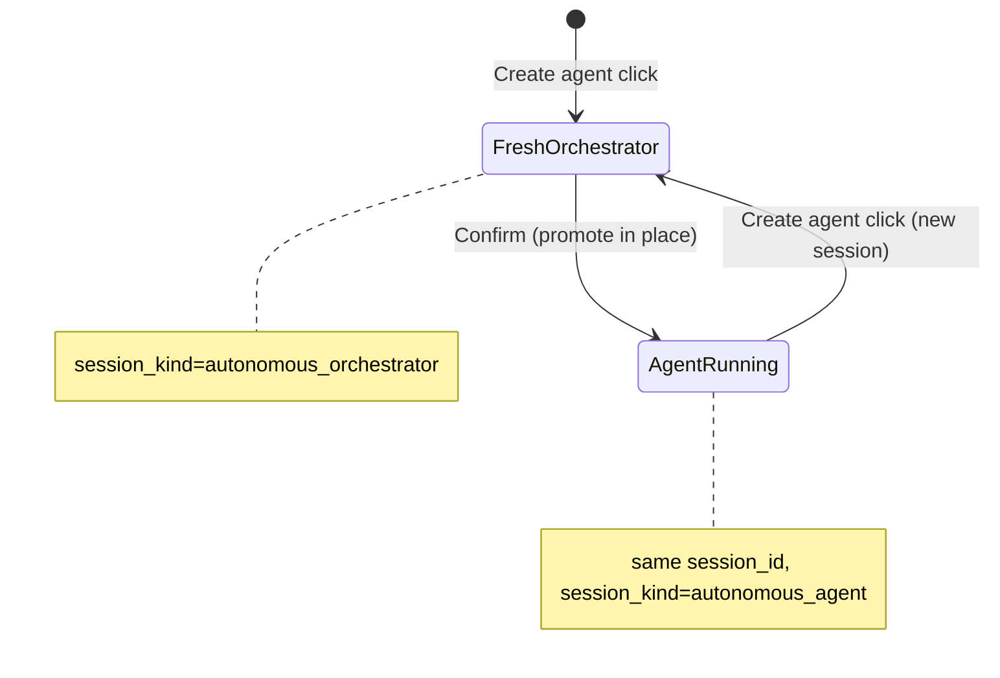

# Create-Agent Session Lifecycle Implementation Plan

> **For agentic workers:** REQUIRED SUB-SKILL: Use superpowers:subagent-driven-development (recommended) or superpowers:executing-plans to implement this plan task-by-task. Steps use checkbox (`- [ ]`) syntax for tracking.

**Goal:** Fix `/autonomous` Create agent so each click opens a **fresh empty orchestrator session**, and on Confirm the **same session promotes** into the running agent session (preserving setup chat) instead of reusing one global orchestrator session forever.

**Architecture:** Remove the singleton orchestrator pointer in `orchestrator.json`. `POST /orchestrator/session` always creates a new `session_kind=autonomous_orchestrator` session. On commit, when `orchestrator_session_id` is present, **mutate that session in place** (config, title, system_note) and bind `agent.vibe_session_id` to it — do not call `create_session` again. Clear orchestrator meta on commit so no stale reuse. Frontend keeps the user on the same `session` URL param after Confirm; only `agent` changes from `orchestrator` → `aa_*`.

**Tech Stack:** Vibe `SessionService` / `SessionStore`, `proposals.commit_autonomous_agent`, `autonomous_routes.py`, React `Autonomous.tsx` + `Agent.tsx`, pytest under `tests/`.

## Global Constraints

- Orchestrator **never executes trades** — propose only; commit is UI-only (`consent_ack`).
- Reuse existing `session_kind` values: `autonomous_orchestrator` → `autonomous_agent`.
- Do not fork chat components — same `Agent.tsx` / SSE path for both modes.
- Non-UI commit paths (e2e scripts without orchestrator session) must still work via fallback `create_session`.
- Do not add new summary docs beyond this plan.
- Max **10 concurrent** running/paused agents (existing cap in `proposals.py`).

---

## Problem (root cause)

| Symptom | Cause | Location |
|---------|-------|----------|
| Create agent always shows old chat | `get_or_create_orchestrator_session` reuses `orchestrator.json → vibe_session_id` | `autonomous_routes.py:111-136` |
| After Confirm, user jumps to a different session | `commit_autonomous_agent` always `create_session()` for the agent | `proposals.py:260-263` |
| Second Create agent reopens stale orchestrator | Meta pointer never cleared on commit | `store.py` `_ORCHESTRATOR_FILE` |

## Target behavior

```
Hub → Create agent
  → POST /orchestrator/session  (NEW session every time)
  → /autonomous?agent=orchestrator&session=<new_id>
  → chat + proposal card
  → Confirm
  → promote session <new_id> to autonomous_agent (SAME id)
  → /autonomous?agent=aa_<id>&session=<new_id>   (chat history preserved)
  → Hub → Create agent again
  → POST /orchestrator/session  (another NEW session, empty chat)
```



---

### Task 1: Session promotion helper

**Files:**
- Create: `integrations/trade_integrations/autonomous_agents/session_promotion.py`
- Test: `tests/test_session_promotion.py`

**Interfaces:**
- Consumes: `SessionService.get_session`, `SessionStore.update_session`, `SessionStore.append_message`, `is_orchestrator_session` from `orchestrator_profile.py`
- Produces:
  - `promote_orchestrator_session(*, session_service, orchestrator_session_id: str, agent_id: str, name: str, session_cfg: dict[str, Any]) -> str` — returns promoted `session_id`
  - Raises `ValueError` if session missing or not orchestrator kind

- [ ] **Step 1: Write the failing test**

```python
def test_promote_orchestrator_session_updates_config_and_title(tmp_path, monkeypatch):
    from trade_integrations.autonomous_agents.session_promotion import promote_orchestrator_session
    from src.session.models import Session
    from src.session.orchestrator_profile import SESSION_KIND_ORCHESTRATOR

    class FakeStore:
        def __init__(self):
            self.session = Session(
                session_id="orch123",
                title="autonomous:orchestrator",
                config={"session_kind": SESSION_KIND_ORCHESTRATOR, "orchestrator": True},
            )
            self.messages = []

        def get_session(self, sid):
            return self.session if sid == "orch123" else None

        def update_session(self, session):
            self.session = session

        def append_message(self, msg):
            self.messages.append(msg)

    class FakeSvc:
        def __init__(self):
            self.store = FakeStore()
            self.events = []

        def get_session(self, sid):
            return self.store.get_session(sid)

        class Bus:
            def __init__(self, outer):
                self.outer = outer

            def emit(self, sid, event, payload):
                self.outer.events.append((sid, event, payload))

        def __init__(self):
            self.store = FakeStore()
            self.event_bus = self.Bus(self)

    svc = FakeSvc()
    cfg = {
        "session_kind": "autonomous_agent",
        "autonomous_agent_id": "aa_abc",
        "symbols": ["NIFTY"],
    }
    out = promote_orchestrator_session(
        session_service=svc,
        orchestrator_session_id="orch123",
        agent_id="aa_abc",
        name="NIFTY autonomous",
        session_cfg=cfg,
    )
    assert out == "orch123"
    assert svc.store.session.config["session_kind"] == "autonomous_agent"
    assert svc.store.session.config["autonomous_agent_id"] == "aa_abc"
    assert svc.store.session.title == "autonomous:NIFTY autonomous"
    assert len(svc.store.messages) == 1
    assert "NIFTY autonomous" in svc.store.messages[0].content
```

- [ ] **Step 2: Run test to verify it fails**

Run: `cd /Users/pratyushmishra/Documents/GitHub/Trade && python -m pytest tests/test_session_promotion.py -v`
Expected: FAIL with `ModuleNotFoundError` or `promote_orchestrator_session` not defined

- [ ] **Step 3: Write minimal implementation**

```python
"""Promote an orchestrator vibe session into a running autonomous agent session."""

from __future__ import annotations

from typing import Any

from src.session.models import Message
from src.session.orchestrator_profile import is_orchestrator_session


def promote_orchestrator_session(
    *,
    session_service: Any,
    orchestrator_session_id: str,
    agent_id: str,
    name: str,
    session_cfg: dict[str, Any],
) -> str:
    orch_sid = str(orchestrator_session_id or "").strip()
    if not orch_sid:
        raise ValueError("orchestrator_session_id is required")

    session = session_service.get_session(orch_sid)
    if session is None:
        raise ValueError(f"orchestrator session not found: {orch_sid}")
    if not is_orchestrator_session(session.config):
        raise ValueError(f"session is not orchestrator: {orch_sid}")

    session.config = dict(session_cfg)
    session.title = f"autonomous:{name}"
    session_service.store.update_session(session)

    transition = Message(
        session_id=orch_sid,
        role="system",
        content=(
            f"Autonomous agent **{name}** (`{agent_id}`) is now running. "
            "This chat continues as the agent session — scheduler and watch ticks will appear here."
        ),
    )
    session_service.store.append_message(transition)
    session_service.event_bus.emit(
        orch_sid,
        "message.received",
        {"message_id": transition.message_id, "role": "system", "content": transition.content},
    )
    session_service.event_bus.emit(
        orch_sid,
        "session.promoted",
        {"session_id": orch_sid, "agent_id": agent_id, "session_kind": "autonomous_agent"},
    )
    return orch_sid
```

- [ ] **Step 4: Run test to verify it passes**

Run: `python -m pytest tests/test_session_promotion.py -v`
Expected: PASS

- [ ] **Step 5: Commit**

```bash
git add integrations/trade_integrations/autonomous_agents/session_promotion.py tests/test_session_promotion.py
git commit -m "feat: promote orchestrator session to agent on commit"
```

---

### Task 2: Commit flow uses promotion (not new session)

**Files:**
- Modify: `integrations/trade_integrations/autonomous_agents/proposals.py:260-290`
- Modify: `integrations/trade_integrations/autonomous_agents/store.py:172-176` (add `clear_orchestrator_meta`)
- Test: `tests/test_commit_session_promotion.py`

**Interfaces:**
- Consumes: `promote_orchestrator_session` from Task 1, `clear_orchestrator_meta()`
- Produces: `commit_autonomous_agent(...)` returns `vibe_session_id == orchestrator_session_id` when promotion path used

- [ ] **Step 1: Write the failing test**

```python
def test_commit_reuses_orchestrator_session(monkeypatch, tmp_path):
    from trade_integrations.autonomous_agents import proposals
    from trade_integrations.autonomous_agents.store import save_proposal

    orch_sid = "orch_commit1"
    proposal_id = "aap_test1"
    save_proposal({
        "proposal_id": proposal_id,
        "status": "ready",
        "symbols": ["NIFTY"],
        "name": "NIFTY bot",
        "mandate": "paper trade",
        "constraints": {"mode": "paper", "budget_inr": 20000, "max_daily_loss_inr": 2000, "confidence_threshold": 75},
        "mandate_config": {},
        "watch_spec": {},
        "schedules": {"watch_ms": 420000, "research_ms": 5400000},
        "alert_rules": {},
        "orchestrator_session_id": orch_sid,
        "expires_at_ms": 9999999999999,
    })

    created = []

    class FakeSession:
        def __init__(self, sid):
            self.session_id = sid

    class FakeSvc:
        def __init__(self):
            self.store = self

        def get_session(self, sid):
            from src.session.models import Session
            from src.session.orchestrator_profile import SESSION_KIND_ORCHESTRATOR
            if sid != orch_sid:
                return None
            return Session(
                session_id=orch_sid,
                title="autonomous:orchestrator",
                config={"session_kind": SESSION_KIND_ORCHESTRATOR, "orchestrator": True},
            )

        def create_session(self, title="", config=None):
            s = FakeSession(f"new_{len(created)}")
            created.append(s)
            return s

        class Bus:
            def emit(self, *a, **k):
                pass

        event_bus = Bus()

    svc = FakeSvc()
    monkeypatch.setattr(proposals, "start_auto_paper", lambda **k: None, raising=False)

    result = proposals.commit_autonomous_agent(
        proposal_id=proposal_id,
        consent_ack=True,
        session_service=svc,
        orchestrator_session_id=orch_sid,
    )
    assert result["vibe_session_id"] == orch_sid
    assert created == []  # must NOT create a new session
    assert result["agent"]["vibe_session_id"] == orch_sid
```

- [ ] **Step 2: Run test to verify it fails**

Run: `python -m pytest tests/test_commit_session_promotion.py -v`
Expected: FAIL — `vibe_session_id` is `new_0`, `created` is non-empty

- [ ] **Step 3: Patch `commit_autonomous_agent`**

Replace the unconditional `create_session` block (~line 260) with:

```python
    orch_sid = str(orchestrator_session_id or proposal.get("orchestrator_session_id") or "").strip()
    vibe_session = None
    if orch_sid:
        existing = session_service.get_session(orch_sid)
        if existing is not None:
            from src.session.orchestrator_profile import is_orchestrator_session
            from trade_integrations.autonomous_agents.session_promotion import promote_orchestrator_session

            if is_orchestrator_session(existing.config):
                promote_orchestrator_session(
                    session_service=session_service,
                    orchestrator_session_id=orch_sid,
                    agent_id=agent_id,
                    name=name,
                    session_cfg=session_cfg,
                )
                vibe_session = existing

    if vibe_session is None:
        vibe_session = session_service.create_session(
            title=f"autonomous:{name}",
            config=session_cfg,
        )
```

After `save_agent(agent)`, add:

```python
    from trade_integrations.autonomous_agents.store import clear_orchestrator_meta

    clear_orchestrator_meta()
```

Add to `store.py`:

```python
def clear_orchestrator_meta() -> None:
    path = _agents_root() / _ORCHESTRATOR_FILE
    if path.is_file():
        path.unlink()
```

- [ ] **Step 4: Run tests**

Run: `python -m pytest tests/test_commit_session_promotion.py tests/test_session_promotion.py -v`
Expected: PASS

- [ ] **Step 5: Commit**

```bash
git add integrations/trade_integrations/autonomous_agents/proposals.py integrations/trade_integrations/autonomous_agents/store.py tests/test_commit_session_promotion.py
git commit -m "feat: bind agent to promoted orchestrator session on commit"
```

---

### Task 3: Always create fresh orchestrator session

**Files:**
- Modify: `vibetrading/agent/src/api/autonomous_routes.py:111-136`
- Test: `tests/test_orchestrator_session_create.py`

**Interfaces:**
- Consumes: `SessionService.create_session`, `build_orchestrator_system_note()`
- Produces: `POST /orchestrator/session` returns a **new** `session_id` on every call; does **not** read/write singleton meta for reuse

- [ ] **Step 1: Write the failing test**

```python
def test_orchestrator_session_always_creates_new(monkeypatch):
    from vibetrading.agent.src.api import autonomous_routes as routes

    ids = []

    class FakeSession:
        def __init__(self, i):
            self.session_id = f"orch_new_{i}"
            self.title = "autonomous:orchestrator"

    class FakeSvc:
        def __init__(self):
            self.n = 0

        def get_session(self, sid):
            return None  # never reuse

        def create_session(self, title="", config=None):
            self.n += 1
            return FakeSession(self.n)

    fake = FakeSvc()
    monkeypatch.setattr(routes, "_session_service", lambda: fake)

    r1 = routes.get_or_create_orchestrator_session()
    r2 = routes.get_or_create_orchestrator_session()
    assert r1.session_id != r2.session_id
    assert r1.session_id == "orch_new_1"
    assert r2.session_id == "orch_new_2"
```

- [ ] **Step 2: Run test to verify it fails**

Run: `python -m pytest tests/test_orchestrator_session_create.py -v`
Expected: FAIL — same session_id returned twice

- [ ] **Step 3: Replace get-or-create with always-create**

```python
@autonomous_router.post("/orchestrator/session", response_model=OrchestratorSessionResponse)
def get_or_create_orchestrator_session() -> OrchestratorSessionResponse:
    from trade_integrations.autonomous_agents.turns import build_orchestrator_system_note

    svc = _session_service()
    if svc is None:
        raise HTTPException(status_code=503, detail="session runtime not enabled")

    session = svc.create_session(
        title="autonomous:orchestrator",
        config={
            "session_kind": "autonomous_orchestrator",
            "orchestrator": True,
            "system_note": build_orchestrator_system_note(),
        },
    )
    return OrchestratorSessionResponse(session_id=session.session_id, title=session.title)
```

Remove imports/usages of `get_orchestrator_meta` / `save_orchestrator_meta` in this handler. Keep `clear_orchestrator_meta` from Task 2 for legacy cleanup on commit.

Optional rename (same PR or follow-up): handler name → `create_orchestrator_session` (route path unchanged for frontend compat).

- [ ] **Step 4: Run tests**

Run: `python -m pytest tests/test_orchestrator_session_create.py tests/test_commit_session_promotion.py -v`
Expected: PASS

- [ ] **Step 5: Commit**

```bash
git add vibetrading/agent/src/api/autonomous_routes.py tests/test_orchestrator_session_create.py
git commit -m "fix: create fresh orchestrator session on every Create agent click"
```

---

### Task 4: Frontend — same session after Confirm, fresh on new Create

**Files:**
- Modify: `vibetrading/frontend/src/pages/Autonomous.tsx:80-104`
- Modify: `vibetrading/frontend/src/pages/Agent.tsx:803-809` (handle `session.promoted` optional)
- Test: manual (no new test file per user rules)

**Interfaces:**
- Consumes: commit API returns `vibe_session_id`; orchestrator API returns new id each click
- Produces: URL transitions `agent=orchestrator&session=X` → `agent=aa_*&session=X`; next Create → new `session=Y`

- [ ] **Step 1: Verify `onAgentCommitted` keeps session when ids match**

`Autonomous.tsx` already sets both params — no change required if backend returns same id. Add a comment:

```typescript
  // After promotion, vibe_session_id === orchestrator session id; only agent param changes.
  const onAgentCommitted = useCallback(
    (newAgentId: string, newSessionId: string) => {
      setSearchParams({
        agent: newAgentId,
        session: newSessionId,
      });
    },
    [setSearchParams],
  );
```

- [ ] **Step 2: Handle agent param change without session reload in `Agent.tsx`**

Add effect keyed on `searchParams.get("agent")` to reset orchestrator-only UI when promoting in place:

```typescript
  const urlAgentId = searchParams.get("agent");
  useEffect(() => {
    if (urlAgentId && urlAgentId !== "orchestrator") {
      // Stop showing orchestrator welcome/proposal poll state after promotion.
      setLiveItems((items) =>
        items.filter((item) => item.kind !== "autonomous_proposal" || committedAutonomous[(item as any).proposal.proposal_id]),
      );
    }
  }, [urlAgentId]); // committedAutonomous optional — keep committed cards visible
```

Optional SSE handler:

```typescript
      "session.promoted": (d) => {
        touch();
        const payload = d as { agent_id?: string; session_id?: string };
        if (payload.agent_id && payload.session_id) {
          onAutonomousAgentCommitted?.(payload.agent_id, payload.session_id);
        }
      },
```

- [ ] **Step 3: Manual verify**

1. Open `/autonomous` → Create agent → confirm URL has `session=A` and empty chat.
2. Send "Create NIFTY paper agent" → proposal card appears.
3. Confirm → URL becomes `agent=aa_*&session=A` (same A), header title = agent name, setup messages still visible, transition system message present.
4. Back to hub → Create agent → URL has `session=B` (B ≠ A), empty chat.
5. Open first agent card → still `session=A`.

- [ ] **Step 4: Commit**

```bash
git add vibetrading/frontend/src/pages/Autonomous.tsx vibetrading/frontend/src/pages/Agent.tsx
git commit -m "fix: keep promoted session in URL; reset orchestrator UI on agent param change"
```

---

### Task 5: Integration verification + doc touch-up

**Files:**
- Modify: `docs/superpowers/specs/2026-07-16-autonomous-agents-design.md:91-104` (Flow 1 — same session promotes)
- Run: existing scripts

- [ ] **Step 1: Update design flow snippet**

Change Flow 1 post-Confirm line to:

```
  → User stays on same session (promoted to aa_*); hub Create agent opens a new empty orchestrator session
```

- [ ] **Step 2: Run backend tests**

Run: `cd /Users/pratyushmishra/Documents/GitHub/Trade && python -m pytest tests/test_session_promotion.py tests/test_commit_session_promotion.py tests/test_orchestrator_session_create.py tests/test_orchestrator_intent.py tests/test_orchestrator_proposal_store.py vibetrading/agent/tests/test_orchestrator_profile.py -q`
Expected: all PASS

- [ ] **Step 3: Smoke e2e commit path (optional if stack up)**

Run: `python scripts/run_nautilus_e2e_paper.py` (commit without orchestrator session still creates new session — unchanged path)

- [ ] **Step 4: Commit**

```bash
git add docs/superpowers/specs/2026-07-16-autonomous-agents-design.md
git commit -m "docs: document orchestrator session promotion lifecycle"
```

---

## Edge cases

| Case | Behavior |
|------|----------|
| User backs out mid-create, clicks Create again | New empty session; old draft remains at old URL if bookmarked |
| Commit without `orchestrator_session_id` (e2e/API) | Fallback `create_session` (unchanged) |
| Proposal already committed (idempotent) | Return existing agent + its `vibe_session_id` |
| Orchestrator session deleted before commit | `ValueError` → 400; user must re-propose in new session |
| Active orchestrator turn when Confirm clicked | Promotion updates config; next turn uses agent tool registry |

## Out of scope (YAGNI)

- Migrating existing singleton orchestrator session in `orchestrator.json` (cleared on next commit; Create agent ignores it after Task 3)
- Wiping orchestrator chat on promotion (user explicitly wants same session to become agent session)
- Browser-tab sync of "current draft" orchestrator across tabs

## Self-review (spec coverage)

| Requirement | Task |
|-------------|------|
| Fresh empty session on each Create agent | Task 3 |
| Same session becomes agent on Confirm | Tasks 1–2 |
| Frontend stays on promoted session | Task 4 |
| Non-UI commit still works | Task 2 fallback branch |
| Tests with exact commands | Tasks 1–3 |
| No placeholder steps | Verified |
