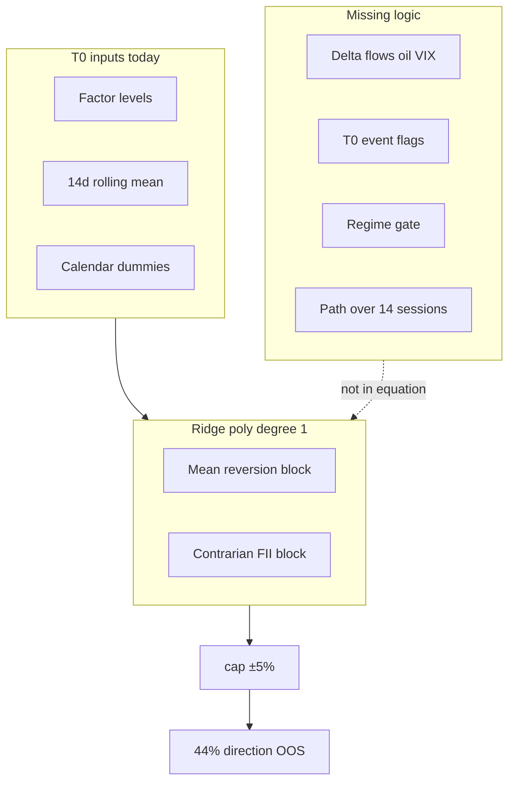
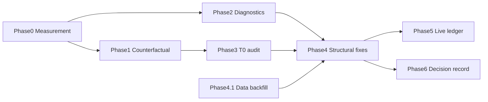

# Prediction Equation Investigation & Logic-Driven Fix Plan

> **For agentic workers:** REQUIRED SUB-SKILL: Use [subagent-driven-development](.cursor/rules/subagent-driven-development.mdc). One implementer per phase; review after each phase before proceeding.
>
> **Persist this plan to:** [`docs/superpowers/plans/2026-07-16-prediction-equation-investigation.md`](docs/superpowers/plans/2026-07-16-prediction-equation-investigation.md) on approval (do not edit the `.cursor/plans/` copy).

**Goal:** Understand why 14d Nifty direction accuracy is ~44% OOS, fix RCA measurement, and improve the macro equation through **structural logic** (features, regime gates, data completeness, horizon alignment) — **not** by adjusting coefficients to match past misses.

**Relates to:**
- Shipped RCA: [`prediction_miss_analysis.py`](integrations/trade_integrations/dataflows/index_research/prediction_miss_analysis.py), [`hub_data_audit.py`](integrations/trade_integrations/dataflows/index_research/hub_data_audit.py)
- Existing quality plan (Phases 5–7 TODO): [`2026-07-16-prediction-quality-phased-fixes.md`](docs/superpowers/plans/2026-07-16-prediction-quality-phased-fixes.md)
- Data completeness: [`2026-07-16-prediction-completeness.md`](docs/superpowers/plans/2026-07-16-prediction-completeness.md)

---

## North star (what we are fixing)

The live forecast path:

```
headline = bottom_up + cap(macro_ridge_poly(T0_factors))
         → optional scenario reconciliation (if divergent >1.5%)
direction = logistic(poly(T0_factors))   [separate head, miscalibrated]
```

The **backtest** validates **macro_ridge only** ([`backtest_runner.py:344`](integrations/trade_integrations/dataflows/index_research/backtest_runner.py)). Current 365d OOS: **44.4% direction**, **4.5% MAE**, **in-sample R² −0.23**.

We are **not** trying to hit 100% on the 10 miss dates. We are building a **repeatable audit** that answers:

1. Given **only T0 facts**, was the equation directionally wrong? (mapping error)
2. Did **facts change during the 14 trading sessions** in ways the static snapshot cannot represent? (horizon dynamics)
3. Was **data missing** at T0 so the equation never saw the signal? (data gap)
4. What **structural change** (not coef tweak) would fix the logic?

---

## Non-negotiable rules (anti-overfitting)

| Allowed | Forbidden |
|---------|-----------|
| Walk-forward OOS metrics on held-out eval rows | Retrain on full sample and claim improvement |
| Add features with **economic justification** (Δ-flow, event dummies) | Add features because they explain Feb–Apr 2026 misses |
| Regime gates **pre-specified** (VIX high/low, trend sign) | Regime thresholds tuned on miss dates |
| Increase Ridge α or reduce poly degree if OOS improves | Lower α to fit in-sample R² |
| Shrink extreme predictions toward scenario anchor | Raise cap from ±5% to ±10% to “fit” magnitude |
| Full DII/FII backfill (data fix) | Impute zeros for missing flow days |
| Ablation: remove block OOS, keep only if hit rate ↑ | Drop factors with wrong sign on misses only |
| Document coef **sign vs literature** before changing structure | Manually edit coefficients in `latest.json` |

**Validation gate (every phase):** `python -m pytest tests/test_prediction_miss_analysis.py tests/test_index_backtest.py -q` plus phase-specific scripts; **direction hit rate must improve on walk-forward eval rows**, not on in-sample fit.

---

## Diagnosis summary (current state)

### Measurement bugs (must fix before trusting RCA)

| Location | Bug | Correct behavior |
|----------|-----|------------------|
| [`prediction_miss_analysis.resolve_maturity_date()`](integrations/trade_integrations/dataflows/index_research/prediction_miss_analysis.py) | Calendar `+14 days` | **14 trading rows** forward (match `close.shift(-14)`) |
| [`prediction_ledger.reconcile_predictions()`](integrations/trade_integrations/dataflows/index_research/prediction_ledger.py) | Calendar maturity | Same trading-row offset |
| [`hub_data_audit._maturity_date()`](integrations/trade_integrations/dataflows/index_research/hub_data_audit.py) | Calendar maturity | Same |
| `event_gap` category | Triggers on generic FII/oil headlines at T1 | Require event tag **absent at T0** headlines |

### Equation logic failures (from [`latest.json`](reports/hub/_data/index_factors/model/latest.json) + backtest)

| Issue | Evidence | Economic logic |
|-------|----------|----------------|
| **Negative OOS R²** | −0.23 (backtest), −0.71 (stored walk-forward) | Return level model has no stable linear mapping |
| **Mean-reversion stack** | Negative coef on `nifty_return_14d`, `rsi`, `ma20_distance`, `constituent_momentum` | Fades moves; fails in **trend/shock** regimes (Feb–Apr 2026 cluster) |
| **Contrarian FII** | `fii_net_5d` corr −0.44 with forward return; negative coef | “After heavy selling, bounce” — wrong when selling **accelerates** |
| **DII unused** | +0.32 corr; coef ≈ 0; **49.6% coverage** | DII cushion signal never fully enters equation |
| **Static T0 → 14-session target** | Large FII/DII/oil drift on every miss | Levels at T0 under-specify **path** over horizon |
| **Cap saturation** | 5/10 misses: raw ±8–17%, capped ±5%, direction wrong | Cap hides bad extrapolation, does not fix sign |
| **Misleading direction OOS** | UI 86.7% vs backtest 44.4% | Different protocols; must unify reporting |



---

## Phase 0 — Measurement integrity (P0, ~1 day)

**Objective:** All RCA, ledger reconcile, and audit use the **same horizon definition** as backtest training target.

### Task 0.1 — Centralize trading-day maturity

**Create:** [`integrations/trade_integrations/dataflows/index_research/horizon_dates.py`](integrations/trade_integrations/dataflows/index_research/horizon_dates.py)

```python
def resolve_maturity_trading_date(
    prediction_date: str,
    horizon_trading_days: int,
    trading_dates: list[str],
) -> str | None:
    """Return trading_dates[idx + horizon_trading_days] where idx = prediction_date."""
```

**Modify:**
- [`prediction_miss_analysis.py`](integrations/trade_integrations/dataflows/index_research/prediction_miss_analysis.py) — replace calendar `resolve_maturity_date`
- [`prediction_ledger.py`](integrations/trade_integrations/dataflows/index_research/prediction_ledger.py) — reconcile uses trading maturity
- [`hub_data_audit.py`](integrations/trade_integrations/dataflows/index_research/hub_data_audit.py) — T0/T1 gap matrix uses trading maturity

**Tests:** `tests/test_horizon_dates.py` — synthetic trading calendar, verify Feb 17 + 14 sessions = correct row.

### Task 0.2 — Re-run artifacts

```bash
python scripts/run_index_backtest.py --days 365 --horizon-days 14
python scripts/run_prediction_miss_analysis.py --days 365 --skip-backtest
python scripts/audit_prediction_hub_data.py --days 365
```

**Acceptance:** For 3 spot-check dates, `maturity_date` in miss analysis equals the date of `close.shift(-14)` in aligned history.

### Task 0.3 — Fix `event_gap` classification

**Modify:** [`prediction_miss_analysis.categorize_miss()`](integrations/trade_integrations/dataflows/index_research/prediction_miss_analysis.py)

- Fetch **T0 headlines** via [`_fetch_index_headlines(prediction_date)`](integrations/trade_integrations/dataflows/index_research/causal_attribution.py)
- `event_gap` only if: T1 has war/oil/RBI tag **and** T0 headlines lack that tag

**Acceptance:** Feb 17 miss re-classified only if T0 truly lacked oil/war/RBI narrative.

---

## Phase 1 — Counterfactual decomposition (P0, ~2–3 days)

**Objective:** For each eval row, compute **how much of the error** is explained by (a) T0 mapping, (b) factor drift T0→T1, (c) unexplained — using **fixed walk-forward coefficients at T0** (no refit on the miss).

### Task 1.1 — `prediction_counterfactual.py`

**Create:** [`integrations/trade_integrations/dataflows/index_research/prediction_counterfactual.py`](integrations/trade_integrations/dataflows/index_research/prediction_counterfactual.py)

**Per eval row** (reuse walk-forward artifact trained only on data **before** eval date — same as backtest):

```
1. t0_contributions[]:
     contrib_i = coef_i × poly_term_i(standardize(factor_i @ T0))

2. predicted_T0 = intercept + Σ contrib_i  (+ trust weight if used)

3. actual = actual_forward_return_pct

4. residual = actual - predicted_T0

5. drift_contributions[]:
     Δcontrib_i = coef_i × (poly_term_i(z_T1) - poly_term_i(z_T0))

6. explained_by_drift = Σ Δcontrib_i

7. unexplained = residual - explained_by_drift

8. classification:
   - mapping_error_T0: sign(predicted_T0) ≠ sign(actual) AND |explained_by_drift| < 0.5 × |residual|
   - drift_dominant: |explained_by_drift| ≥ 0.5 × |residual|
   - data_gap_T0: any critical factor null at T0
   - cap_artifact: |raw| > 5% and cap changed sign/magnitude vs raw
```

**Output:** `reports/hub/NIFTY/index_research/counterfactual_latest.json`

**CLI:** `scripts/run_prediction_counterfactual.py --days 365`

### Task 1.2 — Aggregate learning report

Add `summary.mapping_error_count`, `summary.drift_dominant_count`, `top_drift_factors[]` (which factors explain most drift across all misses).

**Acceptance:**
- Sum of `predicted_T0 + explained_by_drift + unexplained ≈ actual` within 0.1% per row
- Every direction miss has a classification
- **No coefficient values modified** in this phase — read-only decomposition

### Task 1.3 — UI panel (optional, small)

Extend [`PredictionMissAnalysisPanel.tsx`](vibetrading/frontend/src/components/prediction/PredictionMissAnalysisPanel.tsx) with T0 contrib bar + drift bar per miss.

---

## Phase 2 — Correlation & coherence audit (P1, ~2 days)

**Objective:** Document which factor **blocks** work together OOS and which **fight each other** — logic table, not coef editing.

### Task 2.1 — `equation_diagnostics.py`

**Create:** [`integrations/trade_integrations/dataflows/index_research/equation_diagnostics.py`](integrations/trade_integrations/dataflows/index_research/equation_diagnostics.py)

| Diagnostic | Method | Output field |
|------------|--------|--------------|
| **Factor-forward corr** | Pearson on aligned 365d history | `factor_correlations` (extend backtest) |
| **Block coherence** | Group factors: `momentum`, `flows`, `global`, `vol`, `calendar` | Per-block OOS hit rate when block included vs ablated |
| **Sign consistency** | Walk-forward coef sign vs literature ([quality plan table](docs/superpowers/plans/2026-07-16-prediction-quality-phased-fixes.md)) | `sign_conflicts[]` |
| **Collinearity** | VIF or pairwise corr > 0.7 within block | `redundant_pairs[]` |
| **Coefficient stability** | Refit every 5 eval rows; track sign flips | `unstable_terms[]` |
| **Regime conditional corr** | Split: VIX>18, VIX≤18, trend_20d± | `regime_correlation_matrix` |

**CLI:** `scripts/run_equation_diagnostics.py --days 365`

**Output:** `reports/hub/NIFTY/index_research/equation_diagnostics_latest.json`

### Task 2.2 — Logic conflict register

Document explicit conflicts to resolve in Phase 4 (structure only):

| Conflict | Logic |
|----------|-------|
| Momentum block negative coef + positive constituent_momentum literature | Mean-reversion vs momentum — **mutually exclusive**; need regime gate |
| FII contrarian coef + forward corr negative | Works in range-bound; fails when flows **accelerate** — need **Δfii** not level |
| DII positive corr + zero coef | Data missing 50% — fix data before interpreting coef |
| Static levels + 14d target | Need **changes** not just levels |

**Acceptance:** JSON report with block ablation hit rates; no model retrain with new α.

---

## Phase 3 — T0 information audit (P1, ~2 days)

**Objective:** Separate **unknowable at T0** from **knowable but not in feature vector**.

### Task 3.1 — T0 event snapshot per eval row

For each eval date:

- **Headlines at T0** ([`causal_attribution._fetch_index_headlines`](integrations/trade_integrations/dataflows/index_research/causal_attribution.py))
- **Calendar at T0** ([`_calendar_events_for_date`](integrations/trade_integrations/dataflows/index_research/backtest_runner.py))
- **Scenario table at T0** (replay [`build_index_scenarios`](integrations/trade_integrations/dataflows/index_research/scenarios.py) when constituent archives exist)
- **Global flags:** `is_results_season`, `is_budget_week`, `days_to_monthly_expiry`

Tag each miss:
- `unknowable_future_shock` — no T0 headline/calendar/scenario; material move at T1
- `knowable_missing_feature` — T0 headline mentions oil/war/RBI but no feature encodes it
- `knowable_ignored` — feature present at T0 but coef/shrinkage zeroed it (e.g. DII)

### Task 3.2 — Constituent archive coverage for hybrid counterfactual

Use [`company_news_backfill`](integrations/trade_integrations/dataflows/index_research/company_news_backfill.py) for **eval miss dates only** (not full 365×50 sweep unless needed).

**Acceptance:** `t0_information_audit.json` with per-miss tags; counts of knowable vs unknowable.

---

## Phase 4 — Structural equation improvements (P2, logic-gated)

**Only implement items that pass Phase 2 ablation + Phase 1 counterfactual evidence.**

### Task 4.1 — Data completeness (prerequisite, not coef change)

From [`prediction-completeness`](docs/superpowers/plans/2026-07-16-prediction-completeness.md):

- Full FII/DII/PCR backfill → `dii_net_5d` coverage >90%
- Remove anomalous `None.csv` daily snapshots
- Re-run diagnostics **before** any feature additions

**Logic:** Cannot interpret DII coef until data exists.

### Task 4.2 — Add **delta features** (economically justified)

**Modify:** [`factor_matrix.py`](integrations/trade_integrations/dataflows/index_research/factor_matrix.py), [`macro_global.py`](integrations/trade_integrations/dataflows/index_research/macro_global.py)

| New feature | Definition | Logic |
|-------------|------------|-------|
| `fii_net_5d_change_5d` | Δ FII 5d sum vs 5 sessions ago | Captures **acceleration** of foreign selling (misses show large horizon drift) |
| `dii_net_5d_change_5d` | Same for DII | DII withdrawal during selloff |
| `oil_brent_change_7d` | % change in Brent over 7 sessions | Mid-horizon oil spike invisible in level-only |
| `india_vix_change_5d` | VIX change | Fear **rising** vs level |

**Validation:** Walk-forward ablation — include block only if OOS direction hit rate ↑ ≥3pp with same eval protocol.

**Forbidden:** Adding deltas tuned to maximize fit on Feb–Apr 2026 only.

### Task 4.3 — Regime gate (pre-specified, not tuned)

**Create:** [`regime_gates.py`](integrations/trade_integrations/dataflows/index_research/regime_gates.py)

Pre-specified rules (from [`classify_regime`](integrations/trade_integrations/dataflows/index_research/regime.py)):

| Regime | Condition | Macro behavior |
|--------|-----------|----------------|
| `high_fear` | `india_vix > 18` | Reduce mean-reversion block weight (momentum terms unreliable) |
| `trend_down` | `trend_20d < -3%` | FII contrarian term disabled (selling may persist) |
| `range_bound` | default | Current Ridge behavior |

Implementation: **blend two pre-trained Ridge artifacts** or **multiply contributor blocks by gate** — not new coefs per miss.

**Validation:** OOS hit rate by regime bucket must improve in `high_fear` + `trend_down` without hurting `range_bound`.

### Task 4.4 — Replace hard cap with scenario-anchored shrinkage

**Modify:** [`predictor.cap_macro_delta()`](integrations/trade_integrations/dataflows/index_research/predictor.py), [`scenarios.reconcile_prediction_with_scenarios`](integrations/trade_integrations/dataflows/index_research/scenarios.py)

**Logic:**
- When `|raw_macro| > 3%`, shrink toward `scenario_anchor_return_pct` (already computed live)
- Cap remains as **last-resort bound** at ±5% but shrinkage activates first
- Document: cap saturation misses should ↓ in counterfactual report

**Forbidden:** Widen cap to ±8% to fit magnitude.

### Task 4.5 — Hybrid backtest (live parity)

From quality plan Phase 6:

**Modify:** [`backtest_runner.py`](integrations/trade_integrations/dataflows/index_research/backtest_runner.py) — `include_bottom_up=True` when `company_research/history/{date}.json` exists.

Report separate metrics: `macro_only` vs `hybrid` direction hit rate.

**Logic:** If hybrid >> macro on same eval rows, live pipeline errors are not macro-only.

### Task 4.6 — Direction head calibration (reporting only first)

**Modify:** [`predictor.py`](integrations/trade_integrations/dataflows/index_research/predictor.py) — expose `direction_model_score` vs `direction_hit_rate_oos`; Platt scaling on walk-forward logits ([quality plan Phase 7](docs/superpowers/plans/2026-07-16-prediction-quality-phased-fixes.md)).

**Logic:** 86.7% stored OOS is misleading; calibrate display to walk-forward backtest protocol.

---

## Phase 5 — Live ledger parity (P2, ~1 day)

**Objective:** When forecasts mature, same counterfactual runs automatically.

- [`prediction_ledger._persist_ledger_miss_analysis()`](integrations/trade_integrations/dataflows/index_research/prediction_ledger.py) — call counterfactual with stored `global_factors` from [`build_prediction_metadata()`](integrations/trade_integrations/dataflows/index_research/prediction_ledger.py)
- API: `GET /trade/index-prediction/counterfactual`
- UI: link from [`ForecastHistorySection`](vibetrading/frontend/src/components/prediction/ForecastHistorySection.tsx)

---

## Phase 6 — Documentation & decision record (P2, ~0.5 day)

**Create:** `reports/hub/NIFTY/index_research/equation_improvement_decisions.md` (generated, not hand-written prose)

For each structural change in Phase 4, record:

- Hypothesis (logic)
- Phase 2 ablation evidence
- Phase 1 counterfactual evidence (which miss class it addresses)
- OOS hit rate before/after
- **Rejected** alternatives and why (e.g. “lower Ridge α rejected — in-sample R² ↑, OOS ↓”)

---

## Validation protocol (every phase)

```bash
# Unit tests
python -m pytest tests/test_horizon_dates.py tests/test_prediction_miss_analysis.py \
  tests/test_index_backtest.py tests/test_prediction_counterfactual.py -q

# Regenerate artifacts (365d window)
python scripts/audit_prediction_hub_data.py --days 365
python scripts/run_index_backtest.py --days 365 --horizon-days 14
python scripts/run_prediction_counterfactual.py --days 365
python scripts/run_equation_diagnostics.py --days 365
python scripts/run_prediction_miss_analysis.py --days 365 --skip-backtest

# Success thresholds (Phase 4+ only — do not chase in Phase 0–3)
# - direction_hit_rate OOS >= 55% on 365d eval rows (18+ samples)
# - mapping_error_T0 share of misses decreases vs baseline
# - in_sample R² must NOT be optimization target
```

---

## Phase dependency graph



---

## Expected outcomes by phase

| Phase | Deliverable | Question answered |
|-------|-------------|-------------------|
| 0 | Fixed maturity + event_gap | Is our RCA measuring the right window? |
| 1 | `counterfactual_latest.json` | Mapping error vs drift vs unexplained? |
| 2 | `equation_diagnostics_latest.json` | Which blocks conflict OOS? |
| 3 | `t0_information_audit.json` | Knowable at T0 vs truly future shock? |
| 4 | Structural changes + OOS metrics | What logic changes help without overfit? |
| 5 | Ledger counterfactual | Does live pipeline learn from matured forecasts? |
| 6 | Decision record | Why each change was made / rejected |

---

## What we explicitly will NOT do

- Manually edit coefficients in [`latest.json`](reports/hub/_data/index_factors/model/latest.json)
- Lower `RIDGE_ALPHA` (50) to improve in-sample R²
- Raise polynomial degree above 2 or add interaction terms without OOS ablation win
- Add “war” dummy fit on 10 miss dates
- Report in-sample direction 86.7% as model accuracy (unify to walk-forward protocol)
- Tune regime thresholds on Feb–Apr 2026 subset

---

## File map (new / modified)

| File | Phase |
|------|-------|
| `horizon_dates.py` | 0 |
| `prediction_counterfactual.py` | 1 |
| `equation_diagnostics.py` | 2 |
| `regime_gates.py` | 4 |
| `scripts/run_prediction_counterfactual.py` | 1 |
| `scripts/run_equation_diagnostics.py` | 2 |
| `docs/superpowers/plans/2026-07-16-prediction-equation-investigation.md` | 0 (this doc) |
| `prediction_miss_analysis.py`, `prediction_ledger.py`, `hub_data_audit.py` | 0 |
| `factor_matrix.py`, `predictor.py`, `backtest_runner.py` | 4 |
| `PredictionMissAnalysisPanel.tsx`, `trade_routes.py`, `api.ts` | 1, 5 |
