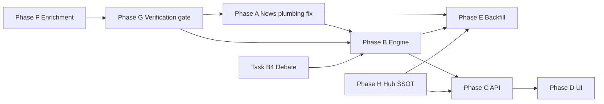

# Prediction Tab — News → Nifty Impact Panel

> **For agentic workers:** REQUIRED SUB-SKILL: Use superpowers:subagent-driven-development. One implementer per task; review after each task.
>
> **Depends on:** `2026-07-16-prediction-equation-investigation.md` (Phase 0–3 measurement + counterfactual), `2026-07-16-nifty-index-research-pipeline.md`

**Goal:** Add a **News → Nifty impact** section on `/prediction` that shows, for each headline (historical + live), which index factors it maps to, how much Nifty **actually** moved (points + %) attributable to that news window, and how much the **model predicted** — with timeline, horizon days, and optional TradingAgents debate excerpt.

**Scope note:** “Nifty 15 index” in the product brief is interpreted as **NIFTY 50 index level** with attribution through the **~15–28 macro factor drivers** in `MACRO_FACTOR_KEYS` (not the separate NSE “Nifty Top 15 EW” index). Horizon default remains **14 trading days** (configurable 1–21).

---

## Re-verification baseline (2026-07-16 artifacts)

| Metric | Before investigation plan | Current (`backtest_latest.json`) | Verdict |
|--------|---------------------------|----------------------------------|---------|
| OOS direction hit (14d walk-forward) | 44.4% | **35.3%** | **Worse** (honest window + unchanged structure) |
| OOS MAE | 4.5% | **4.37%** | Slightly better |
| In-sample R² | −0.23 | **+0.13** | Misleading improvement (not optimization target) |
| Hybrid eval rows | n/a | **0** | Not working — no constituent archives for hybrid |
| Miss: `event_gap` | 4 | **4** | Unchanged — news/events still not in equation |
| Miss: `cap_saturation` | 4 | **4** | Shrinkage exists; cap artifacts persist |
| Miss: `missing_bottom_up` | 3 | **3** | Constituent research history sparse |
| Counterfactual mapping vs drift | n/a | **3 mapping / 4 drift / 4 cap** | Measurement now usable |
| T0 audit headlines | n/a | **0 headlines on all 11 misses** | **Broken** — news pipeline not feeding audit |
| `regime_gates` wired to live predictor | n/a | **No** (`apply_regime_gates_to_contributions` unused) | Accepted in decisions doc but not integrated |

**Why direction got worse (not necessarily “model regressed”):**

1. **Trading-day maturity fix** (`horizon_dates.py`) — eval rows now match `close.shift(-14)`; previously calendar +14 inflated/deflated some labels.
2. **Structural equation unchanged** — mean-reversion stack, contrarian FII level, static T0 → 14-session target.
3. **News still invisible to Ridge** beyond aggregate `index_sentiment`; keyword tags exist only in playground UI.
4. **T0 information audit broken** — `headlines_t0_count: 0`, empty `prediction_date` in rows → all misses tagged `unknowable_future_shock` incorrectly.
5. **Phase 4 items partially shipped** — delta features in matrix; scenario shrinkage in `cap_macro_delta`; regime gates + hybrid backtest not fully wired.

**External research challenges (must design around):**

- **Reverse causality:** returns move sentiment; attributing “news → index” without lag controls overstates fit ([crypto DML literature](https://openreview.net/pdf/fffee4a4c30f1c4f8a4c40d6fa70ec0c7430f351.pdf)).
- **Daily frequency blind spot:** material news often prices in intraday; end-of-day attribution misses immediate impact ([FinBERT macro alpha study](https://arxiv.org/html/2505.16136v1)).
- **Non-linear regime effects:** sentiment impact heterogeneous in high-VIX / macro stress ([Audrino et al. 2024](https://ideas.repec.org/a/oup/jfinec/v22y2024:i:3:p:575-604..html)).
- **Attribution ≠ causation:** SHAP/counterfactual decomposition explains **model** behavior, not ground-truth single-news causality ([BBVA SHAP case studies](https://www.bbvaresearch.com/wp-content/uploads/2025/12/WP_25_14.pdf)).
- **UI must show confidence / shared attribution** — never imply one headline caused X points with 100% certainty.

---

## Architecture

```
┌─────────────────────────────────────────────────────────────────────────┐
│ INGEST (batch + live)                                                   │
├─────────────────────────────────────────────────────────────────────────┤
│  news_aggregator (title + summary body)                                   │
│  _data/news/daily/*.parquet          (archived headlines)               │
│  company_research/*/history/{date}   (constituent news)                 │
│  playground_context / news_watcher   (live material headlines)          │
│  hub NIFTY/agent_debate/latest.json  (TradingAgents themes + view)      │
└───────────────────────────────┬─────────────────────────────────────────┘
                                ▼
┌─────────────────────────────────────────────────────────────────────────┐
│ news_enrichment.py  (NEW — do NOT trust headlines alone)                │
│  1. Fetch full article summary (aggregator summary field, not title)    │
│  2. Build structured summary: facts[], entities[], implied_factors[]    │
│  3. Strip clickbait / deadline framing from working text                  │
└───────────────────────────────┬─────────────────────────────────────────┘
                                ▼
┌─────────────────────────────────────────────────────────────────────────┐
│ news_verification.py  (NEW — approve before impact)                     │
│  1. Extract verifiable claims per implied factor (FII, oil, VIX, …)   │
│  2. Cross-check vs factor store + Nifty move on publish_date ±N days   │
│  3. Status: pending | approved | partial | rejected                     │
│  4. Only approved/partial items flow to impact engine + LLM context     │
└───────────────────────────────┬─────────────────────────────────────────┘
                                ▼
┌─────────────────────────────────────────────────────────────────────────┐
│ news_impact_engine.py                                                   │
│  1. Normalize + dedupe headlines (fingerprint)                          │
│  2. Tag factors: keyword (_NEWS_KEYWORDS) + verified implied_factors    │
│  3. Predicted impact: simulate.shock + Ridge coef path → pts + %        │
│  4. Actual impact: factor deltas T0→T+N + counterfactual drift share    │
│  5. Reconcile at horizon maturity → actual_nifty_pts                    │
│  6. Link debate excerpts (theme overlap / cited symbols)                │
└───────────────────────────────┬─────────────────────────────────────────┘
                                ▼
┌─────────────────────────────────────────────────────────────────────────┐
│ STORE                                                                   │
│  reports/hub/_data/news_impact/ledger.parquet  (one row per headline)   │
│  reports/hub/NIFTY/index_research/news_impact_latest.json (UI snapshot) │
└───────────────────────────────┬─────────────────────────────────────────┘
                                ▼
┌─────────────────────────────────────────────────────────────────────────┐
│ API + UI                                                                │
│  GET  /trade/index-prediction/news-impact                               │
│  POST /trade/index-prediction/news-impact/reconcile (batch maturity)    │
│  NewsImpactPanel.tsx — live poll via existing prediction poll interval  │
└─────────────────────────────────────────────────────────────────────────┘
```

**Integration with `run_index_research` / Run analysis:**

- After `debate_synthesis` stage, call `build_news_impact_snapshot()` and attach `news_impact` block to hub `latest.json`.
- Fix `t0_information_audit` to consume the **same headline fetch path** as `news_impact_engine` (not empty RSS).

---

## Data contract (`news_impact_latest.json`)

```json
{
  "as_of": "ISO8601",
  "ticker": "NIFTY",
  "horizon_days": 14,
  "spot": 24500.0,
  "debate_summary": {
    "view": "bearish",
    "confidence": 0.72,
    "as_of": "ISO8601",
    "excerpt": "…"
  },
  "items": [
    {
      "id": "sha256_prefix",
      "published_at": "2026-07-16T09:30:00+05:30",
      "title": "…",
      "url": "…",
      "source": "google_news_rss | news_archive | company_research | debate_theme",
      "content_summary": "Factual 2–4 sentence summary from article body — not the headline.",
      "structured_summary": {
        "facts": ["FII sold ₹X cr over 5 sessions", "Brent rose 4% on supply fears"],
        "entities": ["FII", "Brent", "RBI"],
        "implied_factors": ["fii_net_5d", "oil_brent"]
      },
      "verification": {
        "status": "approved | partial | rejected | pending",
        "verified_at": "ISO8601",
        "claims": [
          {
            "claim": "Foreign investors net sold over the week",
            "factor": "fii_net_5d",
            "verdict": "supported | contradicted | unverifiable",
            "evidence": "fii_net_5d -6210 → -23024 over 14 sessions",
            "data_as_of": "2026-02-24"
          }
        ],
        "approval_note": "Approved: 2/3 claims supported by factor data; headline overstated magnitude."
      },
      "status": "live | pending_horizon | reconciled",
      "tagged_factors": [
        { "factor": "oil_brent", "confidence": 0.85, "method": "keyword" }
      ],
      "horizon_trading_days": 14,
      "maturity_date": "2026-08-05",
      "predicted": {
        "return_pct": -1.2,
        "nifty_points": -294.0,
        "factor_contributions": [
          { "factor": "oil_brent", "return_pct": -0.8, "nifty_points": -196.0 }
        ],
        "model": "ridge_shock_v1"
      },
      "actual": {
        "return_pct": -0.9,
        "nifty_points": -220.5,
        "factor_deltas": [
          { "factor": "oil_brent", "t0": 82.1, "t1": 88.4, "delta_pct": 7.7 }
        ],
        "attribution_share_pct": 35.0,
        "reconciled_at": "ISO8601"
      },
      "debate_link": {
        "matched": true,
        "excerpt": "Agents flagged oil/geopolitical risk …"
      },
      "timeline": [
        { "day": 0, "label": "News", "nifty_level": 24500 },
        { "day": 14, "label": "Maturity", "nifty_level": 24279.5 }
      ],
      "confidence_note": "Model-attributed share; other concurrent headlines may explain remainder."
    }
  ],
  "summary": {
    "live_count": 3,
    "pending_count": 12,
    "reconciled_count": 180,
    "mean_abs_prediction_error_pts": 85.2
  }
}
```

---

## Attribution methods (v1 — explicit, testable)

| Layer | Method | Output |
|-------|--------|--------|
| **Predicted** | Reuse `simulate.py`: apply `event_preset` or factor shock from headline tags → `scenario_return_pct - baseline_return_pct` → × spot → points | `predicted.nifty_points` |
| **Actual (factor path)** | `factor_snapshot_at(T0)` vs `T0+N` for tagged factors; map Δ to return via fixed walk-forward coefs (same as counterfactual drift) | `actual.factor_deltas` |
| **Actual (index)** | Nifty close at `published_date` vs `maturity_date` (trading rows) | `actual.return_pct`, `actual.nifty_points` |
| **Attribution share** | `|explained_by_tagged_drift| / |actual_return|` capped at 100%; if concurrent news same day, split share equally | `attribution_share_pct` |

**Forbidden in v1:** claiming single-headline causal impact without concurrent-day split; training new coefs on news text; feeding unverified headlines to LLM/agent context as facts.

---

## Phase F — News enrichment & summarization (prerequisite for verification)

### Task F.1 — `news_enrichment.py`

**Create:** `integrations/trade_integrations/dataflows/index_research/news_enrichment.py`

**Responsibilities:**
- `enrich_headline(raw) -> EnrichedNewsItem` with `content_summary`, `structured_summary`
- Prefer `NewsArticle.summary` from `news_aggregator` when available
- Fallback: title de-clickbait + archive parquet lookup by fingerprint
- Never pass raw headline alone to factor tagging or LLM prompts

**Acceptance:** Enriched item has non-empty `content_summary` when aggregator summary exists; `facts[]` has ≥1 entry for material headlines.

### Task F.2 — Extend archive schema

**Modify:** `market_intelligence_archive.py` — persist `summary` column in news daily parquet when present.

---

## Phase G — Data verification gate (approve before use)

### Task G.1 — `news_verification.py`

**Create:** `integrations/trade_integrations/dataflows/index_research/news_verification.py`

**Verification rules (v1 — rule-based, no LLM):**

| Claim type | Data check | Verdict |
|------------|------------|---------|
| FII selling/buying | `fii_net_5d` sign + Δ over `[publish_date, publish_date+5 sessions]` | supported if sign matches narrative |
| DII cushion | `dii_net_5d` sign vs claim | supported / contradicted |
| Oil shock | `oil_brent_change_7d` or `oil_brent` Δ% > 2% | supported if threshold met |
| VIX fear spike | `india_vix_change_5d` > 0 and level rose | supported |
| RBI rate move | `repo_rate` unchanged OR calendar has MPC | contradicted if headline claims hike but rate flat |
| Geopolitical / war | no direct series — tag `unverifiable` unless oil/VIX corroborate | partial |

**Approval logic:**
- `approved`: ≥1 supported claim, zero contradicted
- `partial`: mix of supported + unverifiable, zero contradicted
- `rejected`: any contradicted critical claim OR headline-only with zero data match
- `pending`: not yet checked (live intraday)

**Store:** `reports/hub/_data/news_verified/ledger.parquet`

### Task G.2 — Gate downstream consumers

**Modify:** `news_impact_engine.py`, `playground_context.py`, `t0_information_audit.py`, `aggregator.py`

Only `verification.status in (approved, partial)` items appear in:
- News impact panel
- Factor tagging for predictions
- Agent/debate context injection

**Acceptance:** Rejected clickbait headline (e.g. "Nifty to crash 20%") does not appear in impact panel; shows in admin/rejected filter only.

---

## Phase A — Fix news data plumbing (prerequisite)

### Task A.1 — Repair T0 headline fetch + audit rows

**Files:**
- Modify: `integrations/trade_integrations/dataflows/index_research/t0_information_audit.py`
- Modify: `integrations/trade_integrations/dataflows/index_research/causal_attribution.py` (fallback to `_data/news/daily/` when RSS empty)
- Test: `tests/test_t0_information_audit.py`

**Acceptance:**
- For `2026-02-17` miss, `headlines_t0_count > 0` OR archived parquet row exists.
- `prediction_date` populated on every audit row.
- Tag counts include `knowable_missing_feature` where oil/war headlines exist at T0.

### Task A.2 — Wire `regime_gates` into live macro prediction

**Files:**
- Modify: `integrations/trade_integrations/dataflows/index_research/predictor.py`
- Test: `tests/test_regime_gates.py` (extend)

**Acceptance:** High-VIX day reduces mean-reversion contributor weight in `factor_contributors` output.

---

## Phase B — News impact engine (backend)

### Task B.1 — `news_impact_engine.py`

**Create:** `integrations/trade_integrations/dataflows/index_research/news_impact_engine.py`

**Functions:**
- `collect_headlines_for_window(ticker, start, end) -> list[HeadlineRow]`
- `tag_headline_factors(title, summary) -> list[TaggedFactor]`
- `predict_impact(headline, macro_factors, spot, horizon) -> PredictedImpact`
- `reconcile_impact(headline_id, as_of) -> ActualImpact | None`
- `build_news_impact_snapshot(ticker, horizon_days) -> dict`
- `append_to_ledger(rows) -> Path`

**Sources (priority order):**
1. `reports/hub/_data/news/daily/{date}.parquet`
2. `company_research/{SYMBOL}/history/{date}.json` aggregated for Nifty 50
3. Live RSS via existing `_fetch_index_headlines`
4. Debate themes from `load_agent_debate_json("NIFTY")`

### Task B.2 — Ledger + reconcile job

**Create:**
- `reports/hub/_data/news_impact/ledger.parquet` schema
- `scripts/reconcile_news_impact.py` (maturity pass, callable from nightly calibration)

**Modify:** `integrations/trade_integrations/dataflows/index_research/prediction_ledger.py` — optional hook after forecast reconcile.

### Task B.3 — Hub + aggregator integration

**Modify:**
- `integrations/trade_integrations/dataflows/index_research/aggregator.py` — stage `news_impact` after debate
- `integrations/trade_integrations/dataflows/index_research/hub_writer.py` (if separate) — persist block

**Acceptance:** `latest.json` contains `news_impact.items` with ≥1 live headline when material news exists.

### Task B.4 — TradingAgents debate enrichment

**Modify:**
- `integrations/trade_integrations/research/debate_synthesis.py` — export `debate_themes[]` + `cited_headlines[]`
- Ensure index debate runs when stale on `POST /index-prediction/run` (mirror stock path)

**Acceptance:** Panel shows “Agents recommended: bearish — …” linked to overlapping headlines.

---

## Phase C — API

### Task C.1 — Routes

**Modify:** `vibetrading/agent/src/api/trade_routes.py`

| Route | Purpose |
|-------|---------|
| `GET /trade/index-prediction/news-impact` | Latest snapshot + optional `?status=live` |
| `POST /trade/index-prediction/news-impact/reconcile` | Admin/batch maturity fill |
| Extend `GET /trade/index-prediction/playground-context` | Include `news_impact_items` slice for workbench |

**Modify:** `vibetrading/frontend/src/lib/api.ts` — types + client methods.

---

## Phase D — UI (`NewsImpactPanel`)

### Task D.1 — Component

**Create:** `vibetrading/frontend/src/components/prediction/NewsImpactPanel.tsx`

**Layout (per item card):**
- Headline + source + published time
- Factor chips (oil, FII, VIX, …) with delta badges
- Two-column impact: **Predicted** vs **Actual** (points + %), grey “pending” until maturity
- Mini timeline (day 0 → horizon)
- Debate excerpt accordion when linked
- Confidence footnote (attribution share, concurrent news)

**Modify:** `vibetrading/frontend/src/pages/Prediction.tsx`
- Insert section after **Causal factor sensitivity** (news is the *cause*, factors are the *channel*, Nifty is the *effect*)
- Replace minimal `NewsTriggerPanel` with link: “3 material headlines → see impact panel”

### Task D.2 — Live refresh

**Modify:** `vibetrading/frontend/src/hooks/useIndexPredictionLive.ts`
- On poll tick: fetch `news-impact` if `material_news_count > 0` or every Nth tick
- Merge into panel state; flash new rows

**Acceptance:** New headline appears within one poll interval without full Run analysis.

---

## Phase E — Historical backfill (miss dates first)

### Task E.1 — Backfill script

**Create:** `scripts/backfill_verified_news.py --days 365 --prioritize-miss-dates`

- Seed hub `records.parquet` from `_data/news/daily/` + miss analysis dates (cache-first)
- Run `scripts/reconcile_news_impact.py` for matured rows only

**Supersedes:** thin `backfill_news_impact.py` ledger-only path — hub SSOT is authoritative.

**Acceptance:** Feb–Apr 2026 miss cluster shows non-zero headline cards with predicted vs actual.

---

## Phase H — Hub SSOT (verified news repository)

**Status:** Shipped (2026-07-16)

**Goal:** Make `reports/hub/_data/news_verified/records.parquet` the single source of truth for verified+summarized news. UI snapshot (`news_impact_latest.json`) is a derived materialized view — not re-verified on every read.

### Hub data model

| Store | Path | Purpose |
|-------|------|---------|
| Verified records | `_data/news_verified/records.parquet` | One row per canonical story (`canonical_story_id`) |
| Impact ledger | `_data/news_impact/ledger.parquet` | Predicted vs actual reconcile events |
| UI snapshot | `NIFTY/index_research/news_impact_latest.json` | Derived view for Predictions tab |

**Record columns:** `canonical_story_id`, `title`, `content_summary`, `structured_summary`, `sources[]`, `verification_status`, `verification`, `verification_data_as_of`, `predicted_impact`, `actual_impact`, `maturity_date`, audit timestamps.

### Cache-first pipeline

```
collect → merge_raw_headlines (cross-source dedup)
  → lookup canonical_story_id in hub
  → cache hit: reuse stored verification
  → cache miss: enrich → verify → predict → upsert_verified_record
→ build_snapshot_from_hub → news_impact_latest.json
```

**Re-verify only when:** new source merged, `verification_data_as_of` stale, `pending` status, or `--force-reverify`.

### Tasks (implemented)

| Task | Module / script |
|------|-----------------|
| Hub store | `hub_storage/verified_news_store.py` |
| Cross-source dedup | `index_research/news_dedup.py` + `news_collect.py` |
| Cache-first engine | `news_impact_engine.py` (`needs_reverify`, `ingest_headlines_for_day`) |
| Maturity reconcile | `scripts/reconcile_news_impact.py` + evening `calibration_orchestrator` |
| Backfill | `scripts/backfill_verified_news.py` |
| Hub inventory | `manifest.py`, `duckdb_views.py`, `verify_hub_integration.py` |
| API + UI | `GET /index-prediction/news-impact?refresh=` + `NewsImpactPanel` sources/rejected toggle |
| Tests | `tests/test_verified_news_store.py`, extended `tests/test_news_impact_engine.py` |

### Acceptance

- Same story from 2+ sources → one hub row, `sources.length >= 2`, longest summary kept
- Second pipeline run on unchanged day → zero new verification calls (cache hit)
- Rejected stories persisted with `verification_status=rejected` (queryable, hidden in UI by default)
- Matured stories have `actual_impact.nifty_points` after reconcile
- `manifest.json` lists `news_verified_records` ledger

---

## Validation

```bash
python -m pytest tests/test_news_impact_engine.py tests/test_verified_news_store.py -q
python scripts/backfill_verified_news.py --days 90 --prioritize-miss-dates
python scripts/reconcile_news_impact.py
python scripts/hub_inventory.py --write
python scripts/run_index_research.py --symbol NIFTY  # second run: verify count should not increase
# UI: /prediction → News → Nifty impact section
```

**Success criteria (product):**
- User sees headline → factors → predicted pts → actual pts (when matured) in one card
- Live headlines appear without manual refresh when poll enabled
- TradingAgents view visible when debate artifact exists
- Miss analysis `event_gap` count decreases after T0 headline fix (measurement), not by coef tuning

**Success criteria (honesty):**
- Every card shows `confidence_note` / attribution share
- Docs in panel explain model attribution vs true causation

---

## Phase dependency graph



---

## Out of scope (v1)

- Intraday tick-level news impact (Timescale ticks exist; defer to v2)
- FinBERT/GDELT new vendor (reuse existing sentiment + RSS/archive)
- Causal forest / DML treatment effects (document as v2 research spike)
- Auto-execute trades on news impact

---

## File map

| File | Phase |
|------|-------|
| `news_impact_engine.py` | B |
| `news_impact_ledger.py` (optional split) | B |
| `t0_information_audit.py`, `causal_attribution.py` | A |
| `predictor.py`, `regime_gates.py` | A |
| `aggregator.py`, `debate_synthesis.py` | B |
| `trade_routes.py`, `api.ts` | C |
| `NewsImpactPanel.tsx`, `Prediction.tsx` | D |
| `scripts/backfill_verified_news.py`, `scripts/reconcile_news_impact.py` | E, H |
| `hub_storage/verified_news_store.py`, `index_research/news_dedup.py` | H |
| `tests/test_verified_news_store.py` | H |
