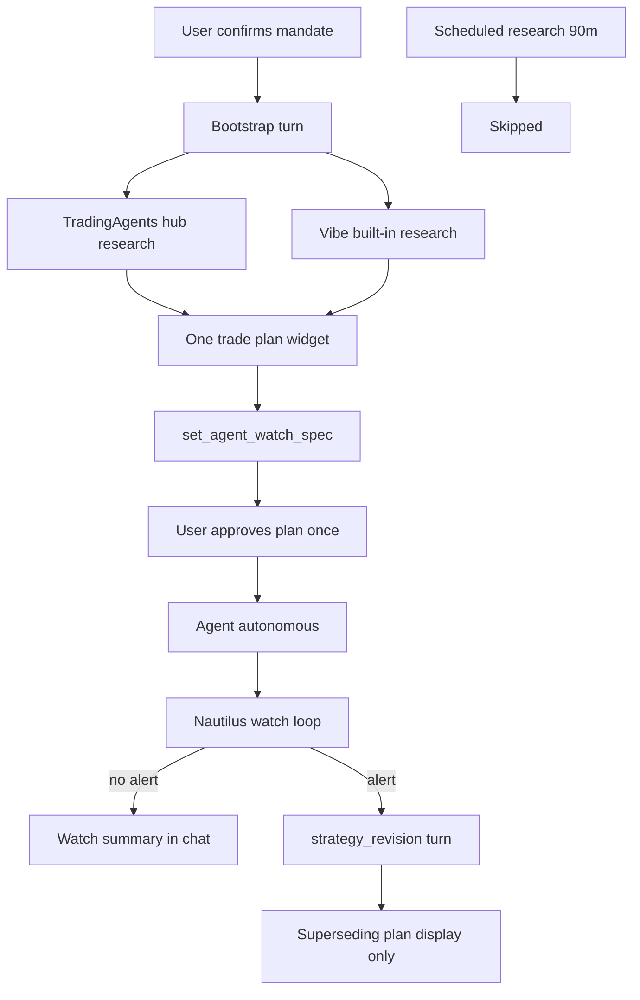

# Autonomous Plan Lifecycle — Bootstrap Once, Approve Once, Nautilus Revises

**Status:** Approved for implementation  
**Goal:** Simple autonomous loop — bootstrap produces one plan + watchers with a single user approval; after that plans are informational; only Nautilus watcher alerts trigger revisions.

---

## Simple mental model (locked)

```
Bootstrap (once)
  → TradingAgents hub research (parallel)
  → Vibe built-in research (browse, ranker, events)
  → Conclude thesis + ONE trade plan + set watchers
  → User approves initial plan → agent goes autonomous

Steady state
  → Show active plan (no confirmation on display)
  → Nautilus evaluates watch_spec continuously
  → Alert only → strategy_revision turn → updated plan (display only)
  → No scheduled research turns; no duplicate plan cards
```

| Phase | User action | System action |
|-------|-------------|---------------|
| **Create agent** | Confirm proposal card (mandate) | Register jobs, start bootstrap |
| **Bootstrap** | — | TradingAgents + Vibe research → plan + `set_agent_watch_spec` |
| **Initial approval** | **Approve plan once** (new UI gate) | Agent status → `running`; Nautilus watch active |
| **Steady state** | None (automated) | Watch ticks; show plan; no re-confirm |
| **Nautilus alert** | None (unless execution below confidence gate) | `strategy_revision` → superseding plan card |

**Key distinction:** Agent creation consent (mandate) ≠ plan approval (thesis + watchers go live). Both are one-time. After plan approval, trade-plan widgets are **read-only informational** in autonomous sessions — no Execute/Confirm on revision cards unless user explicitly opens Strategy Builder.

---

## Problem (what you saw)

RELIANCE agent emitted **two identical trade-plan cards** because bootstrap was followed ~30s later by a scheduled research turn, each calling `get_stock_trade_widget` (new `widget_id` every time). Watchers were set but **never shown**. `hold_cash` incorrectly displayed `HOLD 1× RELIANCE`.

---

## 1. Bootstrap turn (research → plan → watchers)

**Files:** [`turns.py`](../../integrations/trade_integrations/autonomous_agents/turns.py), [`prompt_fragments.py`](../../integrations/trade_integrations/execution/prompt_fragments.py), [`bootstrap.py`](../../integrations/trade_integrations/autonomous_agents/bootstrap.py)

Bootstrap checklist (profile-aware):

1. `get_autonomous_agent_status` — confirmed mandate
2. **Parallel research:**
   - TradingAgents / hub: `get_research_status` → wait for `complete` (options/stock/index as per profile)
   - Vibe built-in: browse, events, market feedback as needed
3. **One** `get_*_trade_widget` call — single trade-plan card
4. `set_agent_watch_spec` — **strategy-derived** Nautilus rules (not generic mandate dump — see §1b)
5. `record_autonomous_decision` with thesis (HOLD/SKIP/ENTER as appropriate)
6. **Stop** — do not call widget tools again; do not loop on status reads

### 1b. Strategy-derived watchers (not random / not all rules)

Watchers are chosen **from the recommended strategy**, not copied blindly from mandate defaults.

**New module:** [`strategy_watch_spec.py`](../../integrations/trade_integrations/autonomous_agents/strategy_watch_spec.py) — `build_watch_spec_for_strategy(strategy, mandate, symbols, spot, target, stop)`

| Strategy | Watchers enabled |
|----------|------------------|
| **hold_cash** | Entry-setup spot move (wider threshold), dip target level if set — **no** position P&L / thesis_break while flat |
| **buy_dip** | Downward spot move, stop level below |
| **momentum_breakout** | Upward spot move, stop level below |
| **event_play** | Either-direction vol move, VIX if options, news |
| **iron_condor / income** | Range breach spot move, VIX expansion |
| **directional options** | Spot move, stop, thesis_break |

Mandate `flatten_at_close` adds session-close rule when intraday. Vibe calls `set_agent_watch_spec` with strategy name; backend derives rules via helper (agent may override with explicit rules only when revising).

Approval card and WatchSpecPanel show **which rules apply and why** (`strategy=hold_cash · RELIANCE dip target · …`).

Agent record after bootstrap:
- `bootstrap_status: "awaiting_plan_approval"` (new state)
- `active_trade_plan_widget_id`, `watch_spec`, `thesis`

**Remove:** `schedule_first_research_after_bootstrap()` (30s duplicate-plan trigger).

---

## 2. Initial plan approval gate (new)

**Files:** New API route in [`autonomous_routes.py`](../../vibetrading/agent/src/api/autonomous_routes.py), new UI in [`Autonomous.tsx`](../../vibetrading/frontend/src/pages/Autonomous.tsx)

After bootstrap completes, show a **Plan Approval card** in the agent session (alongside trade plan + watchers):

- Summary: recommended strategy, confidence, watchers list
- Actions: **Approve & start watching** | **Reject / revise in chat**
- On approve:
  - `bootstrap_status → "done"`, `plan_approved_at` timestamp
  - Ensure Nautilus handoff synced; watch process bound
  - Agent fully autonomous — no further plan confirmations required
- On reject: user message → optional manual revision turn (not automatic)

Until approved, Nautilus may evaluate but **must not** dispatch `strategy_revision` or auto-execute (gate in [`vibe_trigger.py`](../../integrations/nautilus_openalgo_bridge/vibe_trigger.py) + [`watch.py`](../../integrations/trade_integrations/autonomous_agents/watch.py)).

---

## 3. Steady state — display only, Nautilus owns revisions

### 3a. No scheduled research turns

**File:** [`autonomous_agent_jobs.py`](../../vibetrading/agent/src/scheduled_research/autonomous_agent_jobs.py)

- `autonomous_agent_research` job: **no-op** by default (log skip)
- Escape hatch: `AUTONOMOUS_RESEARCH_ON_SCHEDULE=true`
- **Watch job only:** lightweight ticks → `[autonomous_watch]` system lines when no alert

### 3b. Revisions from Nautilus only

**Files:** [`vibe_trigger.py`](../../integrations/nautilus_openalgo_bridge/vibe_trigger.py), [`watch.py`](../../integrations/trade_integrations/autonomous_agents/watch.py)

Full reasoning turn (`strategy_revision`) dispatched **only** when:
- Nautilus WatchActor fires alert → `dispatch_watch_alert`
- OR legacy watch feedback with `requires_action` (India bridge path)

**Not** from: scheduler research, decision guard retry with widget, duplicate bootstrap.

Revision turn may refresh hub research + emit **one superseding** plan widget. Prompt: update thesis, call `record_autonomous_decision` with REVISE/HOLD/EXIT — **no user confirmation on the card**.

### 3c. Autonomous trade-plan UI = informational

**File:** [`TradePlanWidgetCard.tsx`](../../vibetrading/frontend/src/components/chat/TradePlanWidgetCard.tsx)

When `session_kind === autonomous_agent` and `plan_approved_at` is set:
- Hide **Execute (Paper)** and confirm dialog on revision cards (plan is automated context)
- Show badge: **Autonomous · Nautilus-managed**
- Optional link: "Open Strategy Builder" for manual override

Initial bootstrap plan before approval: show Execute only if mandate allows pre-approval entry (default: hide until approved).

### 3d. Widget dedup / supersede

**Files:** [`sessions_routes.py`](../../vibetrading/agent/src/api/sessions_routes.py), [`Agent.tsx`](../../vibetrading/frontend/src/pages/Agent.tsx)

- Suppress duplicate SSE if same underlying + same strategy within 15 min
- In autonomous sessions: **replace** prior plan card for same underlying (mark "Updated by watcher")

---

## 4. Show watchers (always visible after bootstrap)

**New:** `WatchSpecPanel.tsx`  
**Modify:** [`Autonomous.tsx`](../../vibetrading/frontend/src/pages/Autonomous.tsx), [`AutonomousAgentCard.tsx`](../../vibetrading/frontend/src/components/autonomous/AutonomousAgentCard.tsx)

Pinned in agent session after bootstrap:
- `watch_spec.rules[]` — thresholds, symbols, metrics
- `last_watch_at`, `last_watch_summary`
- Nautilus path (`nautilus_detached`, `poll_ok`)

System message after `set_agent_watch_spec`:
```
[autonomous_watchers] RELIANCE — spot_move ≥2%, flatten_at_close. Nautilus detached.
```

---

## 5. Plan quality fixes

**Files:** [`widget_payload.py`](../../integrations/trade_integrations/dataflows/stock_research/widget_payload.py), [`TradePlanWidgetCard.tsx`](../../vibetrading/frontend/src/components/chat/TradePlanWidgetCard.tsx)

- `hold_cash`: empty legs, no target/stop, "Remain in cash" — no fake `HOLD 1×` leg
- Filter vendor error strings from scenario tiles (Tapetide quota, etc.)

---

## Architecture



---

## Tasks

- [ ] **T1** Bootstrap prompt + **strategy-derived** `build_watch_spec_for_strategy` + profile-aware tools
- [ ] **T2** Agent state `awaiting_plan_approval`; remove 30s post-bootstrap research
- [ ] **T3** Plan approval API + UI card (approve/reject)
- [ ] **T4** Gate Nautilus revisions until plan approved; skip scheduled research jobs
- [ ] **T5** Autonomous trade-plan card: informational mode (no Execute on revisions)
- [ ] **T6** WatchSpecPanel + watcher system message + hub card rules
- [ ] **T7** hold_cash fix + scenario error filter + widget supersede in Agent.tsx
- [ ] **T8** Tests + manual RELIANCE: one plan → approve → watchers visible → alert → one revision

## Verification

```bash
pytest tests/test_autonomous_bootstrap.py tests/test_autonomous_watch.py -v
```

Manual:
1. Create RELIANCE agent → one plan + watchers shown
2. Approve plan → no Execute on subsequent revision cards
3. Two watch ticks → system lines only, no new plans
4. Trigger Nautilus alert → one revision plan, superseding prior card

## Out of scope

- Tapetide quota / paid data vendors
- Live execution without mandate confidence gate
- Periodic hub refresh without Nautilus alert (user chose skip-until-alert)

## Execution mode

Subagent-driven development per task; one implementer per task, review after each.
