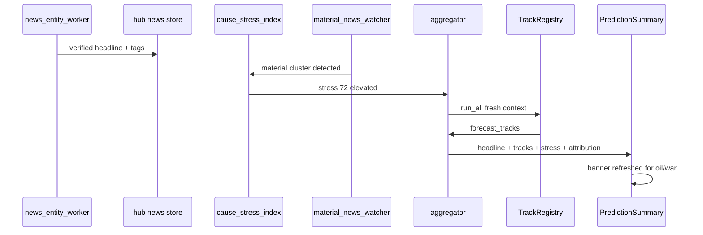

# Prediction Algorithms — Causal Flow, Cause Index & Libraries

> Companion to [master plan](2026-07-17-prediction-algorithms-master-plan.md) and [tracks catalog](2026-07-17-prediction-algorithms-tracks-catalog.md).

**Goal:** Document how **real-world causes** flow through **measurable channels** into **forecast tracks**, how **real-time invalidation** works, and which **libraries** apply at each maturity phase.

**Last updated:** July 2026 — H1 cause modules **shipped**; invalidation UX (M5) pending.

---

## Causal chain (conceptual)

```
Cause (war, Fed hike, FII exodus)
  → News tagged + verified (hub news store)
  → Channel factors update (oil, usd_inr, vix, fii_net_5d)
  → Tracks produce forecasts (quant, scenario, overlay, …)
  → Combiner selects headline (or quant_only default)
  → Horizon matures → reconcile actual → calibrate shocks + scoreboard
```

**Prediction validity:** Low `cause_stress_index` → slow-moving factors dominate → forecast stable. High stress → structural break → **invalidate** prior forecast → refresh tracks.

---

## Layer 0 — Causes (news & events)

### Ingest path (existing)

| Step | Module | Output |
|------|--------|--------|
| Fetch headlines | `news_aggregator`, `news_collect` | raw headlines |
| Entity match | `news_entity_worker`, `news_event_matching` | hub verified records |
| Tag topics | `news_tags` | war, oil, rbi, fii, … |
| Impact snapshot | `news_impact_engine` | `news_impact_latest.json` |
| Daily features | `news_event_features` | `news_*_7d` in factor store |
| Shock calibration | `news_shock_calibration` | median error per topic |

### Cause taxonomy

| Cause ID | Detection | Refresh priority |
|----------|-----------|------------------|
| `geopolitical_war` | `news_war_7d`, war tags | High |
| `oil_supply` | `news_oil_7d`, oil tags | High |
| `us_rates` | `us_10y` move + us_markets news | Medium |
| `us_fiscal` | narrative + sp500/usd | Medium |
| `rbi_policy` | `news_rbi_7d`, repo calendar | High |
| `fii_flow_shock` | `news_fii_7d`, fii_net_5d | High |
| `earnings_cluster` | constituent calendar | Medium |
| `budget/expiry` | calendar flags | Medium |

---

## Layer 1 — Channels (factors)

Full key list: [`MACRO_FACTOR_KEYS`](../../../integrations/trade_integrations/dataflows/index_research/factor_matrix.py) + [`NEWS_EVENT_FACTOR_KEYS`](../../../integrations/trade_integrations/dataflows/index_research/news_event_features.py).

### Channel groups for attribution UI

| Channel | Factors | Typical cause drivers |
|---------|---------|------------------------|
| **Valuation / floor** | `nifty_earnings_yield`, `nifty_dividend_yield`, `nifty_pb_zscore_5y`, `equity_risk_premium` | earnings season, rate vs equity yield gap |
| **Liquidity spreads** | `india_term_spread`, `india_credit_spread`, `repo_rate`, `india_10y` | RBI, credit cycle, G-Sec curve |
| **Energy** | `oil_brent`, `oil_wti` | war, OPEC, Iran |
| **FX / global rates** | `usd_inr`, `usd_inr_momentum_5d`, `us_10y`, `us_10y_velocity_3d` | Fed, INR depreciation, EM outflows |
| **Global risk** | `sp500`, `gold` | US equities, haven flows |
| **India vol** | `india_vix`, `india_vix_velocity_3d`, `nifty_pcr`, `qfinindia_*` | fear spike, positioning |
| **Flows** | `fii_net_5d`, `fii_net_5d_momentum`, `dii_net_5d`, institutional | FII/DII, global risk-off |
| **Technical** | returns, RSI, MA, MACD, … | price feedback |
| **Sentiment** | `index_sentiment`, `news_net_tone_7d` | headlines |
| **Calendar** | budget, expiry, results season | scheduled events |

### Channel attribution (H1) — **shipped**

**Module:** `prediction_algorithms/causes/channel_attribution.py`

**Wired:** `run_forecast_lab()` → hub `prediction.channel_attribution` when `INDEX_PREDICTION_LAB_ENABLED=1`.

**Method:** Marginal contribution from Ridge equation + counterfactual (reuse [`explain.py`](../../../integrations/trade_integrations/dataflows/index_research/explain.py), [`prediction_counterfactual.py`](../../../integrations/trade_integrations/dataflows/index_research/prediction_counterfactual.py)).

**Output on hub artifact:**
```json
{
  "channel_attribution": {
    "valuation_pct": -0.25,
    "liquidity_spread_pct": -0.15,
    "energy_pct": -0.4,
    "fx_rates_pct": -0.2,
    "flows_pct": 0.1,
    "global_risk_pct": 0.15,
    "vol_pct": -0.3,
    "technical_pct": 0.05,
    "sentiment_news_pct": -0.1,
    "unexplained_pct": 0.2
  }
}
```

**Library:** sklearn coefs + numpy — **no new dependency**.

---

## Cause stress index (H1) — **shipped**

**Module:** `prediction_algorithms/causes/cause_stress_index.py`

**Wired:** `run_forecast_lab()` → hub `prediction.cause_stress_index`, `cause_stress_label`, `active_causes`. Scoreboard **Compare** / `stress_conditional` combiner reads stress at combine time.

**UI:** Track Scoreboard live snapshot shows cause stress when hub artifact present. Stale + high-stress **banner** (M5) not yet shipped on Analysis tab.

**Output:** `cause_stress_index` ∈ [0, 100], `active_causes[]`, `recommended_refresh`.

### Formula (v1)

```
stress = clamp(0, 100,
  25 * norm(news_material_7d)
+ 25 * norm(news_surprise_7d)
+ 20 * sum(active_topic_shock_weights)   # from news_shock_calibration
+ 15 * vix_percentile_1y
+ 15 * regime_multiplier                   # high_fear=1.0, range=0.5, trend_down=0.7
)
```

| Range | Label | System behavior |
|-------|-------|-----------------|
| 0–30 | `calm` | Trust `quant_ridge`; standard refresh schedule |
| 30–60 | `elevated` | Show channel attribution; prefer `light_refresh` on material news |
| 60+ | `event_driven` | Force refresh; widen range; scoreboard uses `core_plus_news` combiner preset; UI stale banner if pred age > threshold |

### Invalidation logic

```python
if cause_stress_index >= 60 or material_news_watcher.triggered:
    if prediction_age_minutes > STALE_MINUTES:
        run light_refresh or full index research
        set prediction.provenance.refreshed_for_cause = active_causes
```

**Existing hooks:** `material_news_watcher`, `light_refresh`, `INDEX_MONITOR_*`.

---

## Standard regression predictors (Phase I — formulas)

Canonical definitions for Ridge learning and walk-forward backtest. Full ingest plan: [master plan § Phase I](2026-07-17-prediction-algorithms-master-plan.md#standard-regression-predictors-phase-i--ridge-learning-inputs).

| Predictor | Formula | Factor key |
|-----------|---------|------------|
| Earnings yield | \(\text{E/P} = 100 / \text{P/E}\) | `nifty_earnings_yield` |
| Dividend yield | Index D/P (%) | `nifty_dividend_yield` |
| Book-to-market | \(\text{B/M} = 1 / \text{P/B}\) | `nifty_book_to_market` |
| P/B z-score | \((\text{P/B}_t - \mu_{5y}) / \sigma_{5y}\) | `nifty_pb_zscore_5y` |
| Term spread | \(\text{India 10Y} - \text{91D T-Bill}\) | `india_term_spread` |
| Credit spread | \(\text{BAA yield} - \text{AAA yield}\) (or CRISIL proxy) | `india_credit_spread` |
| FII flow | 5-day rolling sum net FII equity (₹ Cr) | `fii_net_5d` (**Met**) |
| FII momentum | \(\Delta \text{fii\_net\_5d}\) over 5 sessions | `fii_net_5d_momentum` |
| VIX velocity | 3-day % change in `india_vix` | `india_vix_velocity_3d` |
| Equity risk premium | \(\text{ERP} = \text{nifty\_earnings\_yield} - \text{india\_10y}\) | `equity_risk_premium` |
| USD/INR momentum | 5-day % change in `usd_inr` | `usd_inr_momentum_5d` |
| US 10Y spike | 3-day change in `us_10y` | `us_10y_velocity_3d` |

**Expected sign (14d horizon, India EM context):**

- E/P below bond yield, widening credit spread, VIX velocity spike, INR depreciation, US 10Y spike → **headwind** for Nifty.
- High dividend yield floor, steep term spread, positive ERP, FII inflow momentum → **tailwind** (regime-dependent; Ridge learns coefficients).

**Module target:** `index_research/fundamental_features.py` + `spread_features.py` + `sources/india_rates.py` → `factor_backfill_enrichment.py` / `history_loader.py` → `phase_i_coverage.py` → `MACRO_FACTOR_KEYS`.

| Module | Status |
|--------|--------|
| `fundamental_features.py` | **Shipped** — E/P, B/M, z-score, ERP derivations |
| `spread_features.py` | **Shipped** — velocities, term spread, FII momentum |
| `india_rates.py` | **Shipped** — proxy 10Y/T-Bill; env overrides for credit |
| `phase_i_coverage.py` | **Shipped** — ≥45% / ≥180d gate before Ridge auto-include |
| Real D/P, P/B, CRISIL credit backfill | **Pending** |

---

## Layer 2 — Tracks (see catalog)

Cause-aware track selection for **stress_conditional** combiner (H1):

| cause_stress | Suggested combiner preset |
|--------------|---------------------------|
| 0–30 | `quant_only` or `equal_weight_2` (macro+scenario) if promoted |
| 30–60 | log all; headline unchanged unless promoted |
| 60+ | **report-only:** weight `scenario_anchor` + `event_overlay` in scoreboard; live headline still gated by promotion |

---

## Layer 3 — Combiners

See [tracks catalog](2026-07-17-prediction-algorithms-tracks-catalog.md) for math. Cause layer **does not bypass** +3 pp promotion gate.

---

## Library strategy (by phase)

### Phase now — no new pip deps

| Library | Role | Already in stack? |
|---------|------|-------------------|
| **numpy / pandas** | Combiners, cause index, scoreboard | Yes |
| **sklearn** | Ridge, logistic direction, attribution | Yes (`vibetrading/agent/requirements.txt`) |

### H2 — optional scientific stack

| Library | Role | When to add | Install |
|---------|------|-------------|---------|
| **statsmodels** | VAR/SVAR, IRFs for oil→USD→VIX→Nifty | ≥2y aligned daily on 4–6 vars | likely transitive; pin if needed |
| **localprojections** | Jordà LP IRFs ("+10% oil → Nifty 14d path") | same data gate as SVAR | `pip install localprojections` (optional extra) |

**H2 deliverable:** `reports/hub/NIFTY/index_research/shock_irf_latest.json` — e.g. oil shock 10% → Nifty cumulative return h=1..14.

**Mini SVAR spec (H2):**
- Endogenous: `[oil_brent_ret, usd_inr_ret, india_vix, nifty_ret]`
- Identification: Cholesky (oil → usd → vix → nifty ordering)
- Library: `statsmodels.tsa.vector_ar.svar_model.SVAR`

**Local projections spec (H2):**
- Shock: standardized oil return at t
- Horizons h=0..14 on Nifty forward return
- Library: `localprojections.LP` or hand-rolled Jordà regressions

### H3 — research only (defer production)

| Library | Role | Why defer |
|---------|------|-----------|
| **dowhy** | DAG mediation war→oil→nifty | Needs curated DAG + refutation; small n |
| **econml** | heterogeneous treatment | Overkill for v1 |
| **sktime / statsforecast** | univariate TS ensembles | Wrong abstraction for heterogeneous tracks |
| **LightGBM** | macro track | Gated by `ml_experiments_defer.py` |

### Explicitly rejected for combiner merge

| Library | Reason |
|---------|--------|
| sktime `EnsembleForecaster` | Expects uniform Forecaster objects on one y series |
| AutoML weight search | Overfits at n≈18 |

---

## Real-time flow (material event)



---

## Improvement loops (causes)

| Data accumulates | What improves |
|------------------|---------------|
| Reconciled news stories | `news_shock_calibration` topic magnitudes |
| Matured ledger rows | Track/combiner scoreboard stability |
| Miss analysis + attribution | Which **channel** to fix (data vs model) |
| H2 IRF history | Agent/UI: "typical oil shock path" |
| Archived debate (Phase G) | `debate_numeric` backtest + promotion eligibility |

---

## H1 implementation tasks

| Task | File | Depends |
|------|------|---------|
| `compute_cause_stress_index()` | `causes/cause_stress_index.py` | news features, shock calibration |
| `compute_channel_attribution()` | `causes/channel_attribution.py` | explain, counterfactual |
| Wire into aggregator | `aggregator.py` | Phase B tracks |
| Hub + API fields | `latest.json`, `trade_routes.py` | — |
| UI stress + attribution panel | `PredictionSummary.tsx` | Phase E |
| Invalidation banner | frontend + `prediction.provenance` | material watcher |

---

## H2 implementation tasks

| Task | File | Depends |
|------|------|---------|
| Align channel panel for SVAR | extend `history_loader` | 2y daily |
| `run_shock_irf_analysis()` | `causes/shock_irf.py` | statsmodels |
| CLI `scripts/run_shock_irf.py` | scripts | H2 |
| UI IRF snippet (oil shock) | optional panel | H2 data |

---

## Success criteria

**H1:** Prediction tab shows cause stress 0–100, top 3 active causes, channel attribution bars, refresh banner on stress spike.

**H2:** At least one published IRF (oil → Nifty 14d) with confidence band from aligned history.

**Lab (Phases A–F):** See [master plan](2026-07-17-prediction-algorithms-master-plan.md).
