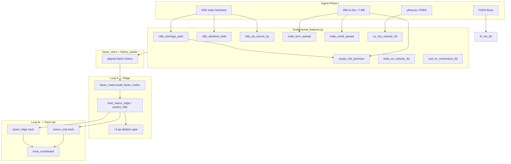
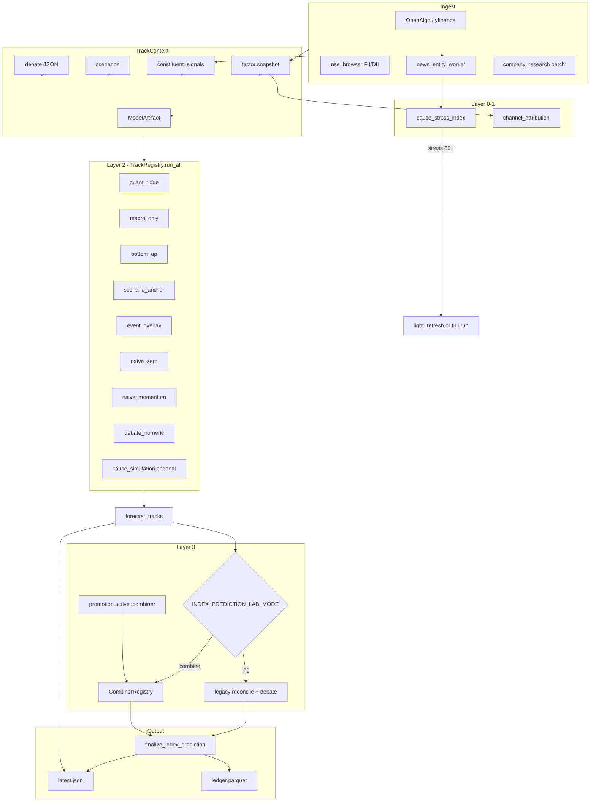
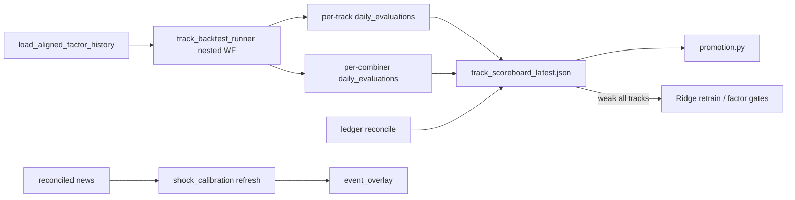

# Prediction Algorithms Lab — Master Plan

> **For agentic workers:** REQUIRED SUB-SKILL: Use superpowers:subagent-driven-development for implementation phases.

**Supersedes / extends:** [2026-07-16-prediction-master-plan.md](2026-07-16-prediction-master-plan.md) (Ridge + OOS gates); adds **track lab + causal layer**.

**Companion docs:**
- [Tracks & combiners catalog](2026-07-17-prediction-algorithms-tracks-catalog.md)
- [Causal flow, cause index, libraries](2026-07-17-prediction-algorithms-causal-flow.md)
- [Risks, assumptions & pre-mortem](2026-07-17-prediction-risks-assumptions-premortem.md)

**Goal:** Replace hand-tuned merge ratios (25/75 scenario reconcile, 60/40 debate) with an evidence-based system: **log independent forecast tracks → score on walk-forward history → merge only if OOS gate passes**, while exposing **real-world causes → factor channels → attribution**.

**North star:** `quant_ridge` remains canonical headline until a combiner beats it on direction **+3 pp** (same gate as [master plan](2026-07-16-prediction-master-plan.md)). Report-only mode is a valid success outcome.

**Package root:** [`integrations/trade_integrations/dataflows/index_research/prediction_algorithms/`](../../../integrations/trade_integrations/dataflows/index_research/prediction_algorithms/)

**Last updated:** July 2026 (post lab + Phase I + scoreboard UI ship)

---

## Implementation status (July 2026)

| Phase | Status | Notes |
|-------|--------|-------|
| **A** — Package scaffold | **Shipped** | `types`, `config`, `registry`, `context_builder`, `api`, track wrappers, combiner math |
| **B** — Live `forecast_tracks` | **Shipped** | Aggregator hook when `INDEX_PREDICTION_LAB_ENABLED=1`; hub + ledger metadata |
| **C** — Walk-forward scoreboard | **Shipped** | `evaluator/walk_forward.py`, `scoreboard.py`, `track_scoreboard_latest.json`, `scripts/run_track_backtest.py` |
| **D** — Combiners + promotion | **Shipped** | 9 combiners in `combiners/`; `promotion.py` (+ `eval_count ≥ 60`, `backtest_eligible`) |
| **E** — API + UI scoreboard | **Shipped** | `/forecast-lab`, `/track-scoreboard`; Prediction tab **Track Scoreboard** (`?mode=scoreboard`) |
| **F** — Live auto-promotion | **Partial** | `INDEX_PREDICTION_COMBINER=auto` + `combine` mode wired; 2-run stability + bootstrap CI **not** shipped |
| **H1** — Cause layer | **Shipped** | `cause_stress_index.py`, `channel_attribution.py` on hub when lab enabled |
| **I** — Standard regression predictors | **Partial** | Derive modules + coverage gate shipped; real D/P, P/B history, CRISIL credit **pending** |
| **G** | **Not started** | Split overlay track, debate archive, LightGBM |
| **H2 / H3** | **Deferred** | SVAR / DoWhy |

### Shipped beyond original Phase E scope

The scoreboard UI reuses the **Analysis page forecast replay** pattern (`NiftyForecastReplayChart` + lightweight-charts `createSeriesMarkers`):

| Surface | Path |
|---------|------|
| Tab | `vibetrading/frontend/src/pages/Prediction.tsx` — **Track Scoreboard** (`SCOREBOARD_MODE`) |
| Panel | `components/prediction/TrackScoreboardPanel.tsx` |
| Per-track replay | `TrackScoreboardReplaySection.tsx` — **Single track** (←/→ track arrows) + **Compare** (multi-track overlay) |
| Replay charts | `NiftyForecastReplayChart` (extended `forecastIndex` prop), `MultiTrackForecastReplayChart.tsx` |
| Return % summary | `TrackScoreboardChart.tsx` (ECharts — all tracks vs actual forward return) |
| Utils | `lib/trackScoreboardReplayUtils.ts`, `lib/trackScoreboardUtils.ts` |
| Chart payload | `evaluator/chart_series.py` → `build_track_chart_payload()`; `promotion.enrich_scoreboard_with_live()` |

**User flow:** open Track Scoreboard → step tracks with arrows → same anchor slider / Prev·Next forecast as “Where Nifty is heading” on Analysis → optional Compare mode overlays multiple track forecast paths vs Nifty 50 actual.

### Walk-forward vs live track coverage

| Context | Tracks evaluated |
|---------|------------------|
| **Live** (`run_all_tracks`) | All 9 registry tracks incl. `bottom_up`, `debate_numeric`, `headline_legacy` |
| **Walk-forward backtest** | 6 tracks: `quant_ridge`, `macro_only`, `scenario_anchor`, `event_overlay`, `naive_zero`, `naive_momentum` |
| **Walk-forward combiners** | `quant_only`, `equal_weight_2`, `equal_weight_3`, `shrinkage_50`, `stress_conditional` |

`debate_numeric` / `headline_legacy` → live-only (`backtest_eligible: false`). See [tracks catalog](2026-07-17-prediction-algorithms-tracks-catalog.md).

---

## Plug-and-play modular contract (removable feature)

The lab is an **optional sidecar** — not a fork of the index pipeline. One module boundary, one primary API, feature-flagged everywhere.

### Design principles

| Principle | Rule |
|-----------|------|
| **Single entry** | All lab logic via `run_forecast_lab()` in `prediction_algorithms/api.py` |
| **No required coupling** | Default `INDEX_PREDICTION_LAB_ENABLED=0` — aggregator unchanged when off |
| **Input = hub context** | Caller passes `TrackContext` built from hub/cache; lab does not own ingest |
| **Output = JSON dict** | `forecast_tracks`, `combiner`, `cause_layer`, `scoreboard_ref` — no mutation of legacy prediction unless `LAB_MODE=combine` |
| **Removable** | Delete `prediction_algorithms/` + one API route + env flags → zero legacy breakage |

### Primary API (Python)

```python
# prediction_algorithms/api.py
def run_forecast_lab(
    context: TrackContext,
    *,
    mode: Literal["tracks_only", "combine"] = "tracks_only",
    combiner_id: str | None = None,
    include_causes: bool = True,
) -> ForecastLabResult: ...
```

### HTTP endpoint

```
POST /trade/index-prediction/forecast-lab
GET  /trade/index-prediction/forecast-lab?ticker=NIFTY&horizon_days=14
GET  /trade/index-prediction/track-scoreboard?ticker=NIFTY&refresh=false&days=365&horizon_days=14&eval_step=5
```

**Forecast-lab request body (POST optional):** `{ "ticker", "horizon_days", "mode", "combiner_id", "use_hub_cache": true }`

**Forecast-lab response:** `{ "forecast_tracks", "cause_stress_index", "channel_attribution", "combiner", "active_combiner", "meta" }`

**Track-scoreboard response:** `{ "status", "ticker", "report" }` where `report` includes `tracks`, `combiners`, `daily_evaluations`, `nifty_series`, `chart`, `promotion`, optional `live` (merged from hub).

Lab reads hub via existing loaders (`load_index_research`, factor snapshot, debate JSON) — **never duplicates ingest**.

### Feature flags

| Flag | Default | Effect |
|------|---------|--------|
| `INDEX_PREDICTION_LAB_ENABLED` | `0` | If off: API returns 404/disabled; aggregator skips lab |
| `INDEX_PREDICTION_LAB_MODE` | `log` | `log` = tracks only; `combine` = may override headline (Phase F) |
| `INDEX_PREDICTION_COMBINER` | `quant_only` | Active combiner when `combine` |

### Integration point (aggregator)

```python
if lab_enabled():
    lab_result = run_forecast_lab(context, mode=lab_mode())
    prediction["forecast_tracks"] = lab_result.forecast_tracks
    if lab_mode() == "combine" and lab_result.combiner:
        apply_combiner_to_prediction(prediction, lab_result.combiner)
# else: existing legacy path unchanged
```

### Removal checklist

1. Remove `prediction_algorithms/` package
2. Remove `/forecast-lab` and `/track-scoreboard` routes from `trade_routes.py`
3. Remove aggregator `if lab_enabled()` block
4. Remove Prediction **Track Scoreboard** tab + `TrackScoreboardPanel` / replay section / API client types
5. No changes required to `predictor.py`, `scenarios.py`, Ridge artifact

---

## Four-layer framework

| Layer | Question | Deliverable |
|-------|----------|-------------|
| **0 — Causes** | What real-world events are active? | `cause_stress_index`, active topics (war, oil, Fed, RBI) |
| **1 — Channels** | Which factors moved? | `MACRO_FACTOR_KEYS`, `news_*_7d`, channel attribution |
| **2 — Tracks** | What does each forecast method say? | `forecast_tracks` dict (9 live tracks — see catalog) |
| **3 — Combiner** | What headline do we publish? | `CombinerRegistry` + `promotion.py` |

---

## Standard regression predictors (Phase I — Ridge learning inputs)

These are **classical macro/valuation regressors** from the academic and practitioner literature. They do not replace the track lab; they extend **Layer 1 (channels)** and **`quant_ridge` / `macro_only`** Ridge training via [`factor_matrix.py`](../../../integrations/trade_integrations/dataflows/index_research/factor_matrix.py).

**Horizon fit:** Most are **14-day to 1-month trend-extension** signals (structural floor, liquidity, regime) — not next-day price. Walk-forward ablation (+3 pp gate from [2026-07-16-prediction-master-plan.md](2026-07-16-prediction-master-plan.md)) decides which enter `MACRO_FACTOR_KEYS` vs report-only.

### 1 — Valuation & fundamental yields (structural floor)

| Factor key | Definition | Predictive role (14–30d) | Ingest / derive | Status |
|------------|------------|--------------------------|-----------------|--------|
| `nifty_earnings_yield` | E/P = `100 / nifty_pe` (or direct index E/P) | When E/P **below** risk-free bond yield → downward pressure / stagnation | `fundamental_features.py` from `nifty_pe` | **Met** (when P/E present) |
| `nifty_dividend_yield` | D/P — index dividend yield (%) | Spiking D/P = market floor; robust long-horizon buy regime | NSE index factsheet / yfinance dividend yield | **Partial** — column stub; backfill pending |
| `nifty_pb` | Price-to-book (index level) | Raw valuation level | NSE / index factsheet | **Partial** — derive path exists; history backfill pending |
| `nifty_pb_zscore_5y` | `(nifty_pb − μ_5y) / σ_5y` | Extreme P/B vs 5y rolling mean → structural reversal signal | `fundamental_features.py` from daily `nifty_pb` history | **Partial** — needs P/B history |
| `nifty_book_to_market` | B/M = `1 / nifty_pb` | Same as P/B channel; explicit B/M for literature parity | Derive from `nifty_pb` | **Partial** |

**Ridge pin candidate:** `nifty_earnings_yield`, `nifty_dividend_yield` (slow-moving; include when coverage ≥ 45%).

### 2 — Macroeconomic & interest-rate spreads (liquidity drivers)

| Factor key | Definition | Predictive role (14–30d) | Ingest / derive | Status |
|------------|------------|--------------------------|-----------------|--------|
| `india_10y` | India 10-year G-Sec yield (%) | Cost of capital / growth discount | `sources/india_rates.py` (repo proxy + FRED/env override) | **Partial** |
| `india_91d_tbill` | 91-day T-Bill yield (%) | Short-rate anchor | `india_rates.py` proxy | **Partial** |
| `india_term_spread` | `india_10y − india_91d_tbill` | Steepening → expansion (bullish); flatten/invert → consolidation/crash | `fundamental_features.py` / `spread_features.py` | **Met** (when rate cols present) |
| `india_credit_spread` | BAA (or lower-tier) corp yield − AAA corp yield | Widening → credit stress → equity selloff leading indicator | `india_rates.py` env override only | **Partial** — no CRISIL backfill |
| `fii_net_5d` | 5-day rolling sum FII equity net (₹ Cr) | Strongest **short-term** India liquidity directional regressor | `nse_flow_derivatives_backfill`, `macro_global` | **Met** |
| `fii_net_5d_momentum` | 5d change in `fii_net_5d` | Flow acceleration (buy/sell pressure) | `spread_features.py` from flow history | **Met** (when history aligned) |

**Ridge pin candidate:** `fii_net_5d` (already pinned), `india_term_spread` when backfill ≥ 2y.

### 3 — Risk & volatility regimes (momentum accelerators)

| Factor key | Definition | Predictive role (14d) | Ingest / derive | Status |
|------------|------------|----------------------|-----------------|--------|
| `india_vix` | India VIX level | Fear / protection demand | OpenAlgo / NSE | **Met** |
| `india_vix_velocity_3d` | 3-day rate of change of VIX (%, or log-diff) | VIX **velocity** spike → strong **negative** 14d index predictor | `spread_features.py` from VIX history | **Met** (when VIX history aligned) |
| `equity_risk_premium` | ERP = `nifty_earnings_yield − india_10y` | Highly positive → equities cheap vs bonds (institutional inflow); negative → rotation to debt | `fundamental_features.py` | **Partial** (bond proxy quality) |

**Regime gate hook:** `regime_gates.py` — when `india_vix_velocity_3d` > threshold, shrink macro trust or force neutral direction band.

### 4 — Cross-asset & global interdependence (spillover)

| Factor key | Definition | Predictive role (14d) | Ingest / derive | Status |
|------------|------------|----------------------|-----------------|--------|
| `usd_inr` | USD/INR spot | Level + FX stress | yfinance `INR=X` | **Met** |
| `usd_inr_momentum_5d` | 5-day % change in USD/INR | INR depreciation (USD/INR ↑) → reliable **negative** Nifty predictor for foreign-return math | `spread_features.py` | **Met** |
| `us_10y` | US 10-year Treasury yield (%) | Spike draws EM capital to US debt | FRED `DGS10` / macro_global | **Met** |
| `us_10y_velocity_3d` | 3-day change in `us_10y` | Spike detector for walk-forward (not just level) | `spread_features.py` | **Met** |

### Where predictors flow in the stack



### Phase I implementation (factor ingest — not a new track)

| Task | Module | Gate | Status |
|------|--------|------|--------|
| I.1 | `fundamental_features.py` — derive E/P, B/M, P/B z-score, ERP | Unit tests on synthetic series | **Shipped** — `tests/test_fundamental_features.py` |
| I.2 | `spread_features.py` — term spread, velocities, FII momentum | Backfill ≥ 180d aligned history | **Shipped** — `tests/test_spread_features.py`; credit col stub |
| I.2b | `sources/india_rates.py` — india_10y / 91d proxies | Document proxy vs real G-Sec | **Shipped** (proxy) |
| I.3 | `phase_i_coverage.py` + extend `MACRO_FACTOR_KEYS` | Ablation: each group +3 pp or report-only | **Partial** — coverage gate shipped; ablation loop manual |
| I.4 | `factor_catalog.py` + UI factor tooltips | User-visible in `/index-prediction/factors` | **Partial** |
| I.5 | `channel_attribution.py` — valuation + liquidity buckets | Hub JSON includes channels when lab on | **Shipped** |
| I.6 | Walk-forward parity — `macro_only` MAE unchanged when cols missing | `test_parity_macro_only_matches_backtest` | **Pending** |

**Data sources (free / open):** yfinance index metadata, RBI DBIE / weekly T-Bill, existing NSE FII flow backfill, FRED for US 10Y; credit spread via published CRISIL index CSV or documented proxy — no paid vendors.

**Do not double-count:** If both `nifty_pe` and `nifty_earnings_yield` correlate > 0.95, `_REDUNDANCY_PAIRS` keeps E/P and drops raw P/E in Ridge selection (see tracks catalog).

---

## End-to-end flow (live)



### Step-by-step (aggregator)

1. **Ingest** — constituents, macro snapshot, scenarios, optional debate (existing `run_index_research`).
2. **Cause layer** — compute `cause_stress_index` + `channel_attribution` from news features + Ridge sensitivities.
3. **Invalidation** — if `cause_stress_index >= 60` or material news watcher fired → ensure fresh run (not stale cache).
4. **Tracks** — `TrackRegistry.run_all(TrackContext)` → `forecast_tracks` (no cross-track merge).
5. **Headline mode:**
   - `INDEX_PREDICTION_LAB_MODE=log` (Phases B–E): legacy reconcile + debate unchanged; tracks logged only.
   - `INDEX_PREDICTION_LAB_MODE=combine` (Phase F): `CombinerRegistry.combine(tracks, promotion_config)` → headline.
6. **Finalize** — `finalize_index_prediction()` (sign-conflict, view sync, range).
7. **Persist** — hub artifact, ledger with compact track summary in metadata.

---

## End-to-end flow (backtest / improvement)



| Loop | Improves | Mechanism |
|------|----------|-----------|
| **A — Equation** | Ridge coefs, factors | walk-forward retrain, +3 pp ablation gate |
| **B — Merge** | Headline combiner | track scoreboard, promotion |
| **C — Causes** | Overlay magnitudes | `news_shock_calibration` from reconciled stories |
| **D — Live ledger** | Scoreboard n | matured predictions → more eval rows |

---

## Implementation phases

| Phase | Scope | Headline changes? | Status |
|-------|--------|-------------------|--------|
| **A** | Package scaffold, types, track wrappers, tests | No | **Shipped** |
| **B** | Live `forecast_tracks` logging on hub + ledger | No | **Shipped** |
| **C** | `walk_forward.py`, scoreboard JSON, parity gates | No | **Shipped** (6-track WF subset) |
| **D** | Combiners + `promotion.py` | No | **Shipped** |
| **E** | API `/track-scoreboard` + UI tab + per-track replay charts | No | **Shipped** |
| **F** | `INDEX_PREDICTION_COMBINER=auto` live promotion | Yes (gated) | **Partial** |
| **H1** | Cause index, channel attribution, invalidation UX | No (additive) | **Shipped** (index on hub; stale invalidation UX pending M5) |
| **H2** | LP / mini-SVAR IRFs (`statsmodels`, optional `localprojections`) | No | Deferred |
| **H3** | DoWhy DAG research | Defer | Deferred |
| **G** | Split tracks, debate archive, LightGBM (deferred) | Gated | Not started |
| **I** | Standard regression predictors — see [Phase I table](#phase-i-implementation-factor-ingest--not-a-new-track) | No (Ridge inputs) | **Partial** |

---

## Environment flags

| Flag | Values | Default |
|------|--------|---------|
| `INDEX_PREDICTION_LAB_ENABLED` | `0` \| `1` | `0` |
| `INDEX_PREDICTION_LAB_MODE` | `log` \| `combine` | `log` |
| `INDEX_PREDICTION_COMBINER` | `auto` \| `quant_only` \| `equal_weight_2` \| … | `quant_only` |

---

## Artifacts

| Path | Content |
|------|---------|
| `{TICKER}/index_research/latest.json` | `prediction.forecast_tracks`, `cause_stress_index`, `channel_attribution`, `active_combiner` (when combine) |
| `{TICKER}/index_research/track_scoreboard_latest.json` | Track + combiner MAE, direction%, `eval_count`, `daily_evaluations`, `nifty_series`, `chart` payload |
| `_data/index_predictions/ledger.parquet` | Compact track summary in `metadata_json` (`forecast_tracks_summary`) |
| `{TICKER}/index_research/news_shock_calibration.json` | Per-topic shock table (causes) |

### Scoreboard JSON (`track_scoreboard_latest.json`) — shipped fields

| Field | Purpose |
|-------|---------|
| `tracks` / `combiners` | OOS MAE, direction hit rate, `eval_count`, `backtest_eligible` |
| `daily_evaluations` | Per-date, per-track predicted vs actual % |
| `nifty_series` | Nifty close history for replay charts |
| `chart` | UI-ready series from `chart_series.build_track_chart_payload()` |
| `promotion` | Verdicts vs `quant_ridge`; `auto_promote_allowed` when `eval_count ≥ 60` |
| `live` | Merged from hub when `/track-scoreboard` loads (`enrich_scoreboard_with_live`) |

---

## Promotion rules (non-negotiable)

1. Direction: `hit_combiner >= hit_quant + 0.03` on 365d / `eval_step=5`.
2. Must beat **equal_weight** baseline on direction (combination puzzle guard).
3. `eval_count >= 60` for auto-promotion (else report-only).
4. Same combiner wins **two consecutive** backtest runs.
5. Weight stability: `std(w)` across last 3 rolling windows < 0.25.
6. `debate_numeric` excluded from auto-promotion until debate history archived.

**Report-only success:** Lab shipped, scoreboard visible, headline stays `quant_only` — valid if gates never pass.

---

## Global constraints

- Reuse existing modules via track wrappers — **no duplicated Ridge math**.
- Combiners: numpy only in v1 — no sktime as merge engine.
- Walk-forward nested for all weight/λ selection — no full-sample grid search.
- Valid combiner track sets documented in [tracks catalog](2026-07-17-prediction-algorithms-tracks-catalog.md) (no quant + bottom_up double-count).

---

## Validation

```bash
python -m pytest tests/test_prediction_algorithms_tracks.py tests/test_prediction_algorithms_combiners.py -q
python -m pytest tests/test_fundamental_features.py tests/test_spread_features.py tests/test_phase_i_coverage.py -q
python scripts/run_track_backtest.py --ticker NIFTY --days 365 --eval-step 5
python -m pytest tests/test_index_backtest.py tests/test_index_aggregator.py -q
```

**UI smoke:** Prediction → **Track Scoreboard** tab → Recompute scoreboard → step tracks / Prev·Next forecast on replay chart.

---

## Related plans

| Plan | Relationship |
|------|----------------|
| [2026-07-16-prediction-master-plan.md](2026-07-16-prediction-master-plan.md) | Ridge OOS gates, factor promotion |
| [2026-07-17-prediction-review-phase1-pipeline-integrity.md](2026-07-17-prediction-review-phase1-pipeline-integrity.md) | finalize + sign-conflict (post-combiner) |
| [2026-07-17-prediction-risks-assumptions-premortem.md](2026-07-17-prediction-risks-assumptions-premortem.md) | Risks, assumptions, mitigations |
