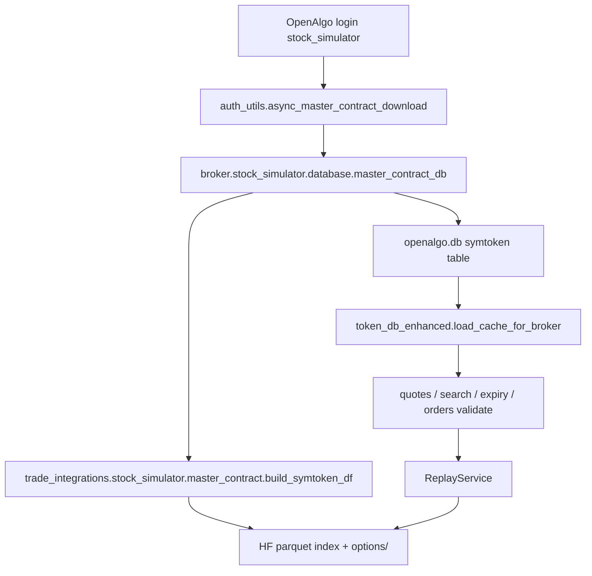

# Stock Simulator Master Contract Implementation Plan

> **For agentic workers:** REQUIRED SUB-SKILL: Use superpowers:subagent-driven-development (recommended) or superpowers:executing-plans to implement this plan task-by-task. Steps use checkbox (`- [ ]`) syntax for tracking.

**Goal:** Make OpenAlgo master contract download work for `stock_simulator` with a **curated but fully functional** symbol universe (NIFTY / BANKNIFTY / SENSEX + their HF-backed options), matching IndMoney OpenAlgo symbol conventions so quotes, search, expiry, and basket orders validate correctly.

**Architecture:** Add a **local parquet-driven contract builder** in `trade_integrations/stock_simulator/` that emits the same `symtoken` rows IndMoney downloads from CSV. Wire it through a thin `openalgo/broker/stock_simulator/database/master_contract_db.py` adapter so existing OpenAlgo login/download/cache paths work unchanged. Scope contracts to HF data available at `NSE_REPLAY_DATE` — limited symbols, all working.

**Tech Stack:** Python 3, pandas, OpenAlgo `symtoken` SQLAlchemy schema, existing HF replay paths (`hf_paths.py`, `options/replay_store.py`).

## Global Constraints

- OpenAlgo is the sole symbol authority — Nautilus/Trade stack must not duplicate symtoken.
- Symbol format must match OpenAlgo canonical naming (`NIFTY25APR2423000CE`, not HF internal `symbol=BANKNIFTY` rows).
- No paid data vendors; contracts derive from local HF parquet only.
- Paper-first: lot sizes / tick sizes use NSE-standard constants, not live broker API.
- Do not download full Dhan/IndMoney CSV for sim — universe is intentionally smaller.

---

## Problem diagnosis (confirmed)

| Failure | Root cause | Evidence |
|---------|------------|----------|
| Master contract download on sim login | **Missing module** `broker.stock_simulator.database.master_contract_db` | `ModuleNotFoundError` on import |
| Master Contract UI stuck / Python strategies blocked | `async_master_contract_download()` sets status `error` | `auth_utils.py` import path |
| Quotes may work for indices only when stale IndMoney symtoken cached | `validate_symbol_exchange()` → `get_token()` | Broker-change should refresh but download fails |
| Option legs / search / expiry APIs fail for sim-specific strikes | No NFO rows for HF strikes at replay date | HF parquet stores `symbol=BANKNIFTY`, not OpenAlgo contract names |
| Log warning on startup | `Master contracts not ready for broker: stock_simulator` | `python_strategy.py` readiness gate |

**Not a bug:** IndMoney downloads ~100k symbols from broker CSV. Simulator should publish **~3 indices + NFO/BFO options for HF underlyings only** — same OpenAlgo APIs, smaller universe.

---

## Target symbol universe (v1)

| Underlying | Index exchange | Options exchange | HF source |
|------------|----------------|------------------|-----------|
| NIFTY | NSE_INDEX | NFO | `index/NIFTY.parquet`, `options/NIFTY/*.parquet` |
| BANKNIFTY | NSE_INDEX | NFO | `index/BANKNIFTY.parquet`, `options/BANKNIFTY/*.parquet` |
| SENSEX | BSE_INDEX | BFO | `index/SENSEX.parquet`, `options/SENSEX/*.parquet` |

**Scoping rules (keeps universe bounded):**

1. Include index row always (3 symbols).
2. Options: expiries where parquet file exists and `expiry >= NSE_REPLAY_DATE`, capped at **12** nearest expiries per underlying (configurable).
3. Strikes: unique `(strike, CE|PE)` present in that expiry file on `NSE_REPLAY_DATE` (use same day filter as `OptionsReplayStore.chain_at`).
4. Skip equities, futures, currency, MCX for v1 (no HF source).
5. Skip INDIAVIX for v1 (not in HF index bundle).

**OpenAlgo symbol format** (match IndMoney `reformat_symbol`):

```
{BASE}{DDMMMYY}{STRIKE}{CE|PE}
Example: BANKNIFTY25APR2448000CE
```

**Synthetic tokens** (stable, unique):

```python
token = f"SIM{hash(symbol + exchange) & 0x7FFFFFFF:010d}"  # or sha256 short hex
```

**Lot sizes (NSE standard):**

| Underlying | lotsize |
|------------|---------|
| NIFTY | 25 |
| BANKNIFTY | 15 |
| SENSEX | 10 |

---

## Architecture diagram



---

### Task 1: HF contract builder (pure logic)

**Files:**
- Create: `integrations/trade_integrations/stock_simulator/master_contract.py`
- Test: `tests/test_stock_simulator_master_contract.py`

**Interfaces:**
- Consumes: `SimConfig` from `load_sim_config()`, `hf_paths.index_slug/options_dir`
- Produces:
  ```python
  def build_symtoken_rows(*, data_root: Path, replay_date: str) -> list[dict[str, Any]]: ...
  def openalgo_option_symbol(base: str, expiry: date, strike: float, opt_type: str) -> str: ...
  ```

- [ ] **Step 1: Write failing tests**

```python
# tests/test_stock_simulator_master_contract.py
from datetime import date
from pathlib import Path

import pytest

from trade_integrations.stock_simulator.master_contract import (
    build_symtoken_rows,
    openalgo_option_symbol,
)

REPO = Path(__file__).resolve().parents[1]
DATA_ROOT = REPO / "data/nse/historic_data"


def test_openalgo_option_symbol_format():
    sym = openalgo_option_symbol("BANKNIFTY", date(2024, 4, 25), 48000, "CE")
    assert sym == "BANKNIFTY25APR2448000CE"


@pytest.mark.skipif(not (DATA_ROOT / "replay/hf-india-index-options-1m").is_dir(), reason="HF data missing")
def test_build_symtoken_rows_includes_indices_and_options():
    rows = build_symtoken_rows(data_root=DATA_ROOT, replay_date="2024-04-15")
    assert rows, "expected non-empty symtoken rows"
    by_key = {(r["symbol"], r["exchange"]) for r in rows}
    assert ("BANKNIFTY", "NSE_INDEX") in by_key
    assert ("NIFTY", "NSE_INDEX") in by_key
    nfo = [r for r in rows if r["exchange"] == "NFO" and r["symbol"].startswith("BANKNIFTY") and r["instrumenttype"] == "CE"]
    assert nfo, "expected BANKNIFTY NFO CE contracts"
    assert any("48000" in r["symbol"] for r in nfo)
```

- [ ] **Step 2: Run test to verify it fails**

Run: `python3 -m pytest tests/test_stock_simulator_master_contract.py -v`  
Expected: FAIL — `ModuleNotFoundError: master_contract`

- [ ] **Step 3: Implement builder**

Key implementation notes:
- Index rows: `{symbol, brsymbol, name, exchange, brexchange, token, expiry: "", strike: 0, lotsize, instrumenttype: "INDEX", tick_size: 0.05}`
- Option rows: scan expiry parquet files; filter `trading_day == replay_date`; `groupby(strike, option_type).first()`
- Map SENSEX options to `exchange=BFO`, `brexchange=BSE`
- Map NIFTY/BANKNIFTY options to `exchange=NFO`, `brexchange=NSE`
- `instrumenttype`: `CE` / `PE` (matches expiry_service filters)

- [ ] **Step 4: Run tests**

Run: `python3 -m pytest tests/test_stock_simulator_master_contract.py -v`  
Expected: PASS

- [ ] **Step 5: Commit**

```bash
git add integrations/trade_integrations/stock_simulator/master_contract.py tests/test_stock_simulator_master_contract.py
git commit -m "feat(sim): add HF-backed symtoken builder for curated universe"
```

---

### Task 2: OpenAlgo broker master_contract_db adapter

**Files:**
- Create: `openalgo/broker/stock_simulator/database/__init__.py`
- Create: `openalgo/broker/stock_simulator/database/master_contract_db.py`
- Modify: none (reuse shared symtoken table pattern from `broker/indmoney/database/master_contract_db.py`)

**Interfaces:**
- Consumes: `build_symtoken_rows()` from Task 1
- Produces: `master_contract_download()`, `search_symbols()`, `init_db()` — same exports as other brokers

- [ ] **Step 1: Write failing import test**

```python
# tests/test_stock_simulator_master_contract.py (append)
def test_openalgo_master_contract_module_importable():
    import importlib
    mod = importlib.import_module("broker.stock_simulator.database.master_contract_db")
    assert hasattr(mod, "master_contract_download")
```

Run from `openalgo/` with repo on PYTHONPATH or via existing test harness.

- [ ] **Step 2: Implement adapter**

Copy structural shell from `broker/indmoney/database/master_contract_db.py` but replace CSV download with:

```python
def master_contract_download():
    from database.master_contract_status_db import update_status
    from broker.stock_simulator.api._trade_path import ensure_trade_integrations_path
    ensure_trade_integrations_path()
    from trade_integrations.stock_simulator.config import load_sim_config
    from trade_integrations.stock_simulator.master_contract import build_symtoken_rows

    cfg = load_sim_config()
    update_status("stock_simulator", "downloading", "Building simulator master contract from HF replay")
    try:
        rows = build_symtoken_rows(data_root=cfg.data_root, replay_date=cfg.replay_date)
        if not rows:
            raise RuntimeError(f"No symtoken rows for replay_date={cfg.replay_date}")
        delete_symtoken_table()
        df = pd.DataFrame(rows)
        copy_from_dataframe(df, broker="stock_simulator")
        msg = f"Built {len(rows)} simulator symbols for {cfg.replay_date}"
        update_status("stock_simulator", "success", msg, total_symbols=len(rows))
        return _safe_socketio_emit("master_contract_download", {"status": "success", "message": msg})
    except Exception as exc:
        update_status("stock_simulator", "error", str(exc))
        return _safe_socketio_emit("master_contract_download", {"status": "error", "message": str(exc)})
```

- [ ] **Step 3: Verify import + manual download**

Run:
```bash
cd openalgo && uv run python3 -c "
from broker.stock_simulator.database.master_contract_db import master_contract_download
master_contract_download()
"
```
Expected: status success, symtoken count > 0

- [ ] **Step 4: Commit**

```bash
git add openalgo/broker/stock_simulator/database/
git commit -m "feat(openalgo): wire stock_simulator master contract download"
```

---

### Task 3: Replay-date cache invalidation

**Files:**
- Modify: `integrations/trade_integrations/stock_simulator/master_contract.py`
- Modify: `openalgo/utils/auth_utils.py` (optional small hook) OR store replay fingerprint in `master_contract_status.exchange_stats`

**Interfaces:**
- Produces: `def sim_contract_cache_key(cfg: SimConfig) -> str: ...` returning e.g. `"2024-04-15|NIFTY,BANKNIFTY,SENSEX"`

- [ ] **Step 1: Write failing test**

When `NSE_REPLAY_DATE` changes, `should_download_master_contract("stock_simulator")` must return `(True, ...)`.

- [ ] **Step 2: Implement fingerprint**

On successful download, persist JSON in `exchange_stats`:
```json
{"replay_date": "2024-04-15", "underlyings": ["NIFTY","BANKNIFTY","SENSEX"]}
```

Extend `should_download_master_contract` for `stock_simulator` only: if fingerprint != current env, force re-download even if downloaded after 08:00 IST.

- [ ] **Step 3: Run targeted tests + manual broker switch**

Run: `python3 -m pytest tests/test_stock_simulator_master_contract.py -v`

- [ ] **Step 4: Commit**

```bash
git commit -m "fix(sim): invalidate master contract when replay date changes"
```

---

### Task 4: End-to-end OpenAlgo API verification

**Files:** none (verification only)

- [ ] **Step 1: Login as stock_simulator + trigger download**

```bash
./trade heal
# login via UI or upsert_auth + hit /stock_simulator/callback
curl -s -X POST http://127.0.0.1:5001/api/master-contract/download -b cookies.txt
curl -s http://127.0.0.1:5001/api/master-contract/ready -b cookies.txt
```

Expected: `"ready": true`

- [ ] **Step 2: Verify symbol validation + quotes**

```bash
API_KEY=...
# Index
curl -s -X POST http://127.0.0.1:5001/api/v1/quotes \
  -H "Content-Type: application/json" \
  -d '{"apikey":"'"$API_KEY"'","symbol":"BANKNIFTY","exchange":"NSE_INDEX"}' | jq '.data.simulated,.data.ltp'

# Option (pick symbol from symtoken search or test output)
curl -s -X POST http://127.0.0.1:5001/api/v1/quotes \
  -H "Content-Type: application/json" \
  -d '{"apikey":"'"$API_KEY"'","symbol":"BANKNIFTY25APR2448000CE","exchange":"NFO"}' | jq '.status'
```

Expected: index `simulated=true`; option quote returns success OR explicit sim error (if per-leg quotes not implemented yet — see Task 5)

- [ ] **Step 3: Verify expiry service**

```bash
curl -s -X POST http://127.0.0.1:5001/api/v1/expiry \
  -H "Content-Type: application/json" \
  -d '{"apikey":"'"$API_KEY"'","symbol":"BANKNIFTY","exchange":"NFO","instrumenttype":"options"}' | jq '.data | length'
```

Expected: > 0 expiries

- [ ] **Step 4: Master Contract UI smoke**

Open `/master-contract` — status **success**, symbol count shown, no perpetual spinner.

---

### Task 5 (optional follow-up): Per-leg option quotes via symtoken

**Context:** `ReplayService.get_quote(symbol, NFO)` may not resolve individual option symbols today — chain API works. If Step 2 option quote fails:

**Files:**
- Modify: `integrations/trade_integrations/stock_simulator/replay.py`
- Modify: `integrations/trade_integrations/stock_simulator/options/replay_store.py`

- [ ] Parse OpenAlgo option symbol → `(underlying, expiry, strike, CE|PE)` using same regex as `token_db_enhanced`
- [ ] Return LTP/OI from HF row at `sim_ts`
- [ ] Add test in `tests/test_stock_simulator_hf_replay.py`

Only implement if Task 4 Step 2 fails — keeps v1 scope minimal.

---

### Task 6: Config + docs in `.env.example`

**Files:**
- Modify: `.env.example` (and comment block in `openalgo/.env` template if present)

```env
# Simulator master contract universe (comma-separated underlyings)
SIM_MC_UNDERLYINGS=NIFTY,BANKNIFTY,SENSEX
# Max option expiries per underlying built into symtoken
SIM_MC_MAX_EXPIRIES=12
```

- [ ] **Step 1: Wire env vars in `master_contract.py`**
- [ ] **Step 2: Document in `.env.example`**
- [ ] **Step 3: Commit**

---

## Verification matrix (definition of done)

| Check | Command / path | Pass criteria |
|-------|----------------|---------------|
| Module exists | import `broker.stock_simulator.database.master_contract_db` | no error |
| Unit tests | `pytest tests/test_stock_simulator_master_contract.py tests/test_stock_simulator_hf_replay.py -q` | all pass |
| Download | Master Contract UI → Download | status success, count > 100 |
| Ready gate | `/api/master-contract/ready` | `ready: true` |
| Index quote | `/api/v1/quotes` BANKNIFTY NSE_INDEX | `simulated: true`, token validates |
| Expiry | `/api/v1/expiry` BANKNIFTY NFO options | non-empty |
| Search | `/api/v1/search` BANKNIFTY NFO | returns CE/PE rows |
| Broker switch | indmoney → stock_simulator login | symtoken refreshes, no stale-only indices |
| Replay date change | change `NSE_REPLAY_DATE`, re-login | auto re-download triggered |

---

## Out of scope (v1)

- Full equity universe (thousands of NSE stocks)
- INDIA VIX index row
- Futures contracts (no HF futures parquet)
- Matching IndMoney's 100k symbol count
- Nautilus bridge changes (already uses OpenAlgo REST + symtoken indirectly)

---

## Risk notes

| Risk | Mitigation |
|------|------------|
| Large symtoken (~50k rows) slows cache load | Cap expiries/strikes; benchmark load time in Task 4 |
| Stale IndMoney symtoken masks bugs | Always `delete_symtoken_table()` on sim download; broker-change rule already forces refresh |
| SENSEX on NSE_INDEX alias | Use BSE_INDEX in symtoken per HF mapping |
| Option quote per-leg not implemented | Task 5 optional; chain + expiry enough for advisor flow v1 |

---

## Execution handoff

Plan complete and saved to `docs/superpowers/plans/2026-07-22-stock-simulator-master-contract.md`.

**Two execution options:**

1. **Subagent-Driven (recommended)** — one implementer subagent per task, review between tasks  
2. **Inline Execution** — implement tasks sequentially in one session

Which approach?
