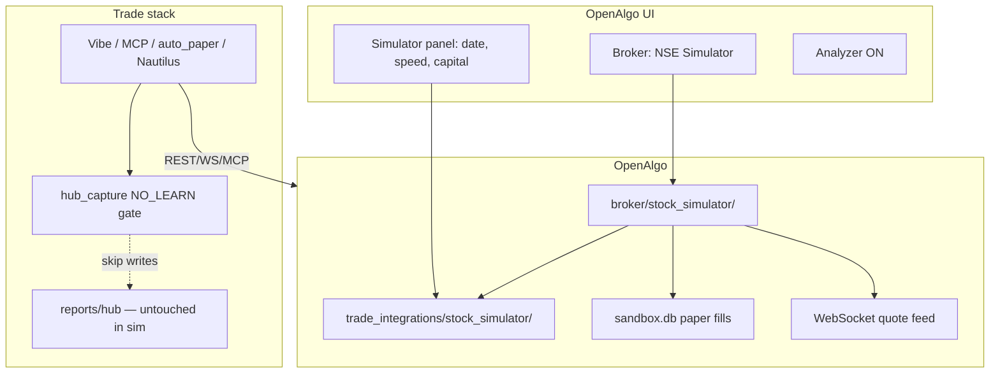

# Stock Simulator — Multi-Phase Implementation Plan

Modular **NSE replay + paper trading** integrated **inside OpenAlgo** as a first-class broker/mode. Agents, MCP, Nautilus, and Vibe all talk to OpenAlgo only — no separate quote path, **no live broker token** when simulator is selected.

## Design intent (confirmed)

Your requirements **make sense** and are the right architecture:

| Requirement | Approach |
|-------------|----------|
| Select simulator in OpenAlgo UI with sandbox money | New broker plugin `stock_simulator` + existing Analyzer/sandbox (`/sandbox`, ₹ capital) |
| No API/broker token in sim mode | Plugin `auth_api.py` = no-op login; data from replay catalog only |
| Market behaves as **live/open** during replay | `SimClock` drives IST session; quotes/WS update like live feed |
| Orders + info via OpenAlgo | Sandbox order path + plugin `data.py` (multiquotes, optionchain, history) |
| **Do not learn** / do not corrupt hub | Global `HUB_NO_LEARN=1` when sim active; skip hub_capture write-through + scheduled capture |

**Treat sim quotes as real-time for trading** (fills, watch rules, agent tools) but **never persist** them into hub capture, research artifacts, or prediction panels.

---

## Architecture



### Why OpenAlgo plugin (not Trade-only injection)

- MCP and OpenAlgo SDK call OpenAlgo **directly** — Trade-side `fetch_multi_quotes_raw()` branch alone is insufficient.
- Pattern exists: [`openalgo/broker/dhan_sandbox/`](../../openalgo/broker/dhan_sandbox/) — we add `stock_simulator` with **zero external broker dependency**.
- Analyzer + sandbox already handle paper money, margin, square-off.

### Core library (shared)

```
integrations/trade_integrations/stock_simulator/
  config.py           # replay date, speed, loop
  sim_clock.py        # IST accelerated clock (Backtrader/Jackson-Wozniak patterns)
  catalog.py          # NSE historic bars (5min CSV + daily parquet)
  quotes.py           # OpenAlgo row shape
  replay.py           # ReplayService
  integration.py      # is_simulator_active(), hub_no_learn()
  options/            # Phase 2
```

### OpenAlgo plugin

```
openalgo/broker/stock_simulator/
  plugin.json
  api/auth_api.py     # auto-login, no credentials
  api/data.py         # get_quotes, get_multiquotes, get_option_chain → ReplayService
  api/order_api.py    # route to sandbox (Analyzer)
  api/funds.py        # sandbox funds
  streaming/          # Phase 1b: replay ticks → WS (optional in 1a)
```

Add `stock_simulator` to `VALID_BROKERS` in `.env`.

---

## Hub no-learn contract (critical)

When simulator is active (`broker == stock_simulator` OR `STOCK_SIMULATOR_MODE=replay`):

| Path | Behavior |
|------|----------|
| [`hub_capture/channel.py`](../../integrations/trade_integrations/hub_capture/channel.py) write-through | **Skip** `record_quote_snapshot`, `record_chain_snapshot` |
| [`hub_capture/writers.py`](../../integrations/trade_integrations/hub_capture/writers.py) | Early return if `hub_no_learn()` |
| [`hub_capture/intraday.py`](../../integrations/trade_integrations/hub_capture/intraday.py) scheduled jobs | Skip when sim active |
| [`openalgo/bulk_history_persist.py`](../../integrations/trade_integrations/openalgo/bulk_history_persist.py) | Skip sim-sourced bars |
| Quote rows | Tag `source: stock_simulator`, `simulated: true`, `sim_ts: ...` |
| L1 memory cache | **Allowed** (session-only, not hub parquet) |

Env flags:

```bash
HUB_NO_LEARN=1                    # auto-set when simulator broker active (default on in sim)
STOCK_SIMULATOR_MODE=replay       # or live
NSE_REPLAY_DATE=2024-07-15
NSE_REPLAY_TIME=09:15
NSE_REPLAY_SPEED=60
NSE_REPLAY_LOOP=1
NSE_REPLAY_DATA_ROOT=data/nse/historic_data
```

Trade-side `fetch_multi_quotes_raw()` may still delegate to OpenAlgo (no duplicate replay logic).

---

## OpenAlgo UI (Phase 1d)

| Surface | Change |
|---------|--------|
| Broker login | **NSE Simulator** option — no API key fields |
| `/sandbox` or new `/simulator` | Replay date picker, speed slider, loop toggle, starting capital (reuse sandbox configs) |
| Status | Badge: `SIM · 2024-07-15 10:42 IST · 10x` |
| Analyzer | Auto-enable when simulator broker selected |

Settings persisted in `sandbox_db` or new `simulator_db` keys: `replay_date`, `replay_speed`, `replay_loop`.

---

## Phases (focused, review between each)

### Phase 1a — Core replay engine

- `stock_simulator/` library (SimClock, ReplayCatalog, ReplayService)
- Unit tests: clock wrap, bar lookup, multiquotes payload shape

**Exit:** `pytest tests/test_stock_simulator_phase1.py`

### Phase 1b — OpenAlgo broker plugin

- `broker/stock_simulator/` data + auth + sandbox order routing
- Wire `quotes_service.py` → plugin for multiquotes/quotes/optionchain (equity/index only in 1b)
- Login without broker token; `VALID_BROKERS` includes `stock_simulator`

**Exit:** `curl` OpenAlgo `/api/v1/quotes` with sim broker session returns replay LTP

### Phase 1c — Hub no-learn gate

- `integration.hub_no_learn()` checked in channel writers + capture jobs
- Tests: sim quote fetch does **not** create capture parquet files

**Exit:** `tests/test_stock_simulator_hub_no_learn.py`

### Phase 1d — UI + session gates

- OpenAlgo frontend: simulator broker + control panel
- Trade: `is_market_session_open()` uses SimClock when sim broker active
- `.env.example` documentation

**Exit:** manual flow — select simulator → multiquotes move → paper order fills → hub capture dir unchanged

### Phase 2 — Options (NFO)

- `stock_simulator/options/synthesizer.py` + plugin optionchain
- FO bhavcopy ingest (nselib/jugaad-data / OpenChart)

### Phase 3 — Tick recorder + L2 replay

- Record live WS during market hours → `data/nse/replay_ticks/`
- Upgrade catalog; optional streaming adapter

### Phase 4 — Ops

- `trade simulator start|status` CLI
- `/autonomous` hub replay badge

---

## Per-phase workflow (mandatory)

```
Implement phase scope only
  → targeted pytest
  → Pass 2: line-by-line diff audit
  → Pass 3: adversarial checklist (fix-review-before-stack)
  → fix CONFIRMED items
  → next phase
```

---

## Status

| Phase | Status |
|-------|--------|
| 1a Core engine | Pending |
| 1b OpenAlgo plugin | Pending |
| 1c Hub no-learn | Pending |
| 1d UI + gates | Pending |
| 2 Options | Pending |
| 3 Tick recorder | Pending |
| 4 Ops | Pending |

**Blocked for code:** plan mode — switch to **Agent mode** and say **execute Phase 1a** to start.
