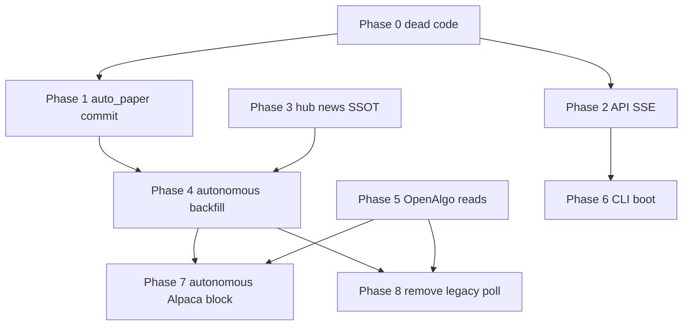

# First-Party Deprecated Migration — Proposed Changes (Design-Aligned)

**Date:** 2026-07-23  
**Status:** Proposed — **Phases 0–8 implemented** (2026-07-23 session); hub news SSOT + autonomous backfill removal + OpenAlgo caller migration complete  
**Parent audit:** [2026-07-23-first-party-deprecated-code-migration-index.md](./2026-07-23-first-party-deprecated-code-migration-index.md)  
**User decisions (2026-07-23):** Autonomous-only Alpaca block · Remove legacy poll now · Include CLI modularization in program

---

## Purpose

Validate every migration item against locked product/design decisions, correct audit errors, and define **exact proposed changes** before implementation. This document is the implementation gate — subplans derive from phases below.

---

## Design authorities (must not violate)

| Authority | Source | Non-negotiable |
|-----------|--------|----------------|
| Autonomous loop | [`autonomous-trading-north-star.mdc`](../../.cursor/rules/autonomous-trading-north-star.mdc) | Vibe = strategy mind; OpenAlgo = sole execution; Nautilus = watch + hard exits; no duplicate watch stacks |
| Options advisor | [`options-advisor-north-star.mdc`](../../.cursor/rules/options-advisor-north-star.mdc) | Browse → research → P&L/charges → step execution |
| Market routing | [openalgo-market-authority-index](./2026-07-23-openalgo-market-authority-index.md) | OpenAlgo `positionbook` wins; `OPENALGO_PAPER_MODE` ops-only; connector port for quotes/execution |
| No permanent shims | [`no-defer-migrate-forward.mdc`](../../.cursor/rules/no-defer-migrate-forward.mdc) | Migrate → delete; no chat-only deferrals |
| Create agent UX | [autonomous-agents-design](../specs/2026-07-16-autonomous-agents-design.md) + draft model | Orchestrator chat → propose → confirm; per-agent cards; paper-first India |
| Watch registry | [unified-watch-registry](./2026-07-22-unified-watch-registry.md) | Registry SSOT; no env watchlists |
| Hub news | Prediction + news scenario specs | `events.parquet` SSOT; entity pipeline default |

---

## Design consistency review

### Fully aligned — proceed as proposed

| Area | Migration | Why it matches design |
|------|-----------|----------------------|
| auto_paper retirement | Commit deletions + scheduler cleanup | North star: single `autonomous_agents` learning stack; no parallel paper runner |
| Dead shims (D-1–D-9) | Delete aliases/modules | `no-defer-migrate-forward`: zero-caller compat layers must go |
| Hub news SSOT (M-1–M-4) | Cutover + shrink adapters | One news truth for prediction scenarios and hub context |
| Draft agent API (A-4) | Remove `POST /orchestrator/session` | Frontend already uses `POST /drafts`; draft `aa_*` is canonical create flow |
| Job-scoped SSE (A-1–A-3) | Remove POST stream entrypoints | Matches prediction job pattern; avoids duplicate streaming paths |
| Watch registry cutover (M-7) | Remove lazy migrate after gate | Unified registry plan shipped; agent `watch_spec` → registry rows |
| OpenAlgo read unification (Phase 5) | Channel + `openalgo.*` imports | Unified data channel plan; one HTTP layer for India reads |
| Bridge importlib shim (E-3) | Direct import | Supports single execution client authority |
| Outcome ledger self-migrate (M-8) | Keep one-time merge | Learning stack SSOT on `outcomes.parquet` |

### Corrected from audit

| Audit item | Was | Corrected proposal | Reason |
|------------|-----|-------------------|--------|
| **A-4** | Migrate `/orchestrator/session` → `/drafts` | **Remove** `/orchestrator/session` only; **`/drafts` is already canonical** | [`Autonomous.tsx`](../../vibetrading/frontend/src/pages/Autonomous.tsx) calls `createDraftAutonomousAgent()`; both routes duplicate same logic |
| **Phase 7 E-1** | Remove `alpaca-paper-sdk` everywhere | **Autonomous-only block**; keep Alpaca default for `/agent` when no OpenAlgo | User decision; market authority removed Alpaca *execution* for agents, not research/interactive fallback |
| **Phase 8 N-1** | Optional poll retirement | **Required** — remove `--legacy-poll` paths now | User decision; Nautilus node is the only watch authority per north star |
| **Phase 6** | Deferred / optional | **In scope** — `stack_lib.sh` → `cli.main serve` | User decision |
| **S-2** `_PINNED_FOR_AUDIT` | Listed as deletable shim | **Keep** | Required by [`prediction-data-completeness.mdc`](../../.cursor/rules/prediction-data-completeness.mdc) audit scripts |
| **create-agent-session-lifecycle plan** | Referenced `/orchestrator/session` as target API | **Superseded by draft-agent model** | Implementation moved to `create_draft_agent` + `POST /drafts`; lifecycle plan goals met via draft promotion |

### BY DESIGN — do not migrate (document only)

| ID | Item | Rationale |
|----|------|-----------|
| R-4 | `watch.py` Nautilus-required error | Hard guardrail; no in-process autonomous watch |
| R-5 | `teardown.py` `legacy_alpaca_path_removed` | Tombstone for removed direct Alpaca execution path |
| E-4 | `dataflows/alpaca.py` research scope | US research/backfill; explicitly not agent execution |
| N-4 | `verify_autonomous_integration.py` rejects legacy poll | CI gate for live node (strengthen after N-1 removal) |
| Proposal `superseded` UI | Orchestrator UX lifecycle | Latest proposal card wins — not deprecated code |

### Upstream — out of scope for this program

Track via submodule merges, not Trade migration phases:

- `cli/_legacy.py` body (upstream Haozhe Wu) — Phase 6 wraps boot path only; does not delete `_legacy.py` in v1
- `mcp_server.py` `--transport sse` (upstream)
- `trading_connector_tool.py` `trading_place_order` (upstream) — hide via Trade execution profile for autonomous sessions instead of deleting upstream tool in Phase 7

---

## Proposed changes by phase

### Phase 0 — Dead code deletion (Type: `cleanup`)

**Goal:** Remove zero-caller symbols; no behavior change.

| Change | Files | Action |
|--------|-------|--------|
| Delete `enqueue_intent` | `nautilus_openalgo_bridge/handoff.py` | Remove alias; grep `submit_intent` |
| Delete `run_once_alpaca` | `nautilus_openalgo_bridge/runtime/poll_loop.py` | Remove function + tests |
| Delete `activate_agent_watch_after_approval` | `autonomous_agents/plan_approval.py` | Remove alias |
| Delete `render_event_page` | `dataflows/hub_wiki/compile.py` | Remove alias |
| Delete module | `dataflows/index_research/news_llm_batch_dedup.py` | Delete file; importers → `news_llm_story_pipeline` |
| Migrate test imports | `tests/test_factor_cascade.py` | Import from `cascade` package; delete `factor_cascade.py` facade |
| Delete component re-export | `frontend/.../ResearchArtifactSidebar.tsx` | Delete file after grep clean |
| Remove dead API helper | `frontend/src/lib/api.ts` | Remove `getOrchestratorSession` |
| Delete `click_download_links` | `nse_browser/session.py` | Remove method if grep clean |
| Keep S-2, S-5 | `prediction_data_requirements.py`, `minimax_agent.py` | No change |

**Gate:** `pytest tests/test_factor_cascade.py tests/test_scheduler_cleanup.py -q`

---

### Phase 1 — auto_paper closeout (Type: `migrate`)

**Goal:** Land completed retirement in git history.

| Change | Action |
|--------|--------|
| Commit deletion of `auto_paper/` (18 files), scripts, `_autopaper_shims.py` | Single focused commit |
| Keep `OBSOLETE_SCHEDULER_JOB_IDS` + cleanup hooks | Delete-only cron hygiene until users' scheduler stores are clean |

**Gate:** `rg auto_paper integrations vibetrading scripts tests` → 0 (except cleanup list + tests)

---

### Phase 2 — API surface modernization (Type: `migrate`)

**Goal:** One streaming contract: job start + job-scoped GET stream.

| Change | Backend | Frontend |
|--------|---------|----------|
| Index prediction run | Remove `POST /index-prediction/run/stream` | Remove `streamIndexPredictionRun` 404 fallback from coordinator |
| External predictions refresh | Remove `POST .../refresh/stream` | Add `startExternalPredictionsRefresh` + `streamExternalPredictionsRefreshJob` (mirror prediction run) |
| Orchestrator route | Remove `POST /autonomous-agents/orchestrator/session` | Already on `POST /drafts` |
| Dead export | — | Remove `getOrchestratorSession` from `api.ts` |

**Design fit:** Same SSE pattern as autonomous agent events; no duplicate kick+stream POST endpoints.

**Gate:** Prediction + external-predictions UI flows pass manual smoke; `pytest tests/test_orchestrator_propose_flow.py -q`

---

### Phase 3 — Hub news events SSOT (Type: `migrate`)

**Goal:** `events.parquet` only; legacy ingest flag removed.

| Step | Action |
|------|--------|
| 1 | Run `ensure_hub_news_migrations()` on dev hub; verify `legacy_remaining=0` (**one-time scripts removed post-cutover**) |
| 2 | Migrate bridge/resolver callers off `distilled_event_to_headline_dict` / `list_verified_records_from_events` to native event reads |
| 3 | Remove `HUB_NEWS_LEGACY_INGEST` branch and `is_legacy_ingest_enabled()` |
| 4 | Drop `news_verified_records_legacy` from hub status after UI/API consumers updated |
| 5 | Remove `iter_legacy_verified_records` from non-migration paths |

**Gate:** `pytest tests/test_news_migrations.py tests/test_news_hub_bridge.py tests/test_hub_news_ingest.py -q --timeout=120`

---

### Phase 4 — Autonomous backfill removal (Type: `migrate`)

**Goal:** No lazy migration on agent load; draft model only.

| Change | Action |
|--------|--------|
| M-5 | **Done** — orphan backfill removed; draft agents created via orchestrator session API only |
| M-6 | Script or admin job: normalize plan-approval widget on all hub agents; **Done** — lazy `ensure_plan_approval_record` removed |
| M-7 | **Done** — registry migration on plan approval + infra heal; per-agent `migrate_agent_watch_spec_to_registry` retained at activation |
| M-9 | Run `migrate_legacy_sources_layout` once on hub wiki roots; keep idempotent call in bootstrap or remove after gate |

**Design fit:** Draft agent + watch registry match autonomous spec; no singleton orchestrator pointer.

**Gate:** `pytest tests/test_watch_registry.py tests/test_autonomous_watch.py tests/test_plan_approval.py -q`

---

### Phase 5 — OpenAlgo read unification (Type: `refactor`)

**Goal:** All India market-data reads via hub channel + `trade_integrations.openalgo`.

| Step | Action |
|------|--------|
| 1 | Migrate ~15 callers off `dataflows/openalgo.py` to `openalgo.market_data` / `hub_capture.channel` |
| 2 | Reduce `dataflows/openalgo.py` to TradingAgents registration shim only (or delete if `register.py` imports canonical) |
| 3 | Replace bridge `importlib` load in `nautilus_openalgo_bridge/openalgo_client.py` with direct `execution.openalgo_client` import |

**Design fit:** Extends [unified-openalgo-data-channel](./2026-07-17-unified-openalgo-data-channel.md); execution unchanged.

**Gate:** `pytest tests/test_openalgo_rest_client.py tests/test_hub_capture_channel.py tests/test_nautilus_execute.py -q`

---

### Phase 6 — CLI boot path (Type: `refactor`) — **user approved in scope**

**Goal:** `trade up` starts API via modular entry; stop depending on `python -m cli._legacy serve`.

| Step | Action |
|------|--------|
| 1 | Add or verify `cli.main serve` subcommand delegates to same uvicorn path as `_legacy serve` |
| 2 | Change [`scripts/stack_lib.sh`](../../scripts/stack_lib.sh) backend cmd to `python -m cli.main serve` |
| 3 | Update test monkeypatch targets: prefer `cli.main` / route modules over `cli._legacy` globals where touched |
| 4 | **Do not delete** `cli/_legacy.py` in this phase (upstream body); only change boot + export surface |

**Design fit:** Operational cleanup; no product behavior change. Reduces "legacy serve" as production path.

**Gate:** `trade up` + `curl /live` 200; `pytest vibetrading/agent/tests/test_system_routes.py tests/test_cli_live.py -q`

---

### Phase 7 — Execution profile scoping (Type: `cleanup`) — **autonomous-only Alpaca block**

**Goal:** Autonomous agents never resolve to direct Alpaca SDK profile; interactive `/agent` keeps fallback.

| Change | Action |
|--------|--------|
| Profile resolution | In `resolve_profile()` / autonomous preflight: if `agent_id` starts with `aa_` and profile is `alpaca-paper-sdk`, fail with clear error → configure OpenAlgo |
| Keep `infer_default_profile_id()` | Still return `alpaca-paper-sdk` when only Alpaca keys present (for `/agent`, research) |
| `trading_place_order` | Do not register or prompt for autonomous sessions; document ENTER path = OpenAlgo MCP basket only |
| Prompt fragments | Update comment to say autonomous + interactive paths explicitly |

**Design fit:** Matches market authority Phase 3–4 for agents; preserves Alpaca for US research (`dataflows/alpaca.py`).

**Gate:** `pytest tests/test_execution_profile.py tests/test_autonomous_mcp_actions.py -q`

---

### Phase 8 — Legacy poll removal (Type: `cleanup`) — **user approved: remove now**

**Goal:** Nautilus TradingNode is the only watch runtime; no parallel poll loop in scripts or CLI.

| Change | Action |
|--------|--------|
| Remove `--legacy-poll` | `run_watch_node.py`, `poll_loop.py` entry surface |
| Update scripts | `run_nautilus_watch.sh`, `test_nautilus_bridge.sh` — node only |
| Remove or rewrite | `tests/test_nautilus_poll_dispatch.py` — cover node dispatch only |
| Keep dry-run | If needed, `--dry-run` on **node** path only, not separate poll loop |
| Docs | Update bridge README / verify script comments |

**Design fit:** North star § Observe module split — Nautilus owns sub-minute polling; removes duplicate watch path.

**Gate:** `scripts/verify_autonomous_integration.py` exit 0; `pytest tests/test_nautilus_watch_registry.py tests/test_nautilus_vibe_trigger.py -q`

---

## Phase dependency graph

**Recommended execution order:** 0 → 1 → 2 → 3 → 4 → 8 → 7 → 5 → 6

(Rationale: poll removal after autonomous/registry stable; CLI boot last to avoid stack churn during API migrations.)

---

## Global constraints (all phases)

- OpenAlgo sole execution authority for autonomous agents (ENTER MCP basket, EXIT bridge intent).
- Nautilus never talks to broker directly.
- No new shims; delete after caller migration gate.
- Submodule upstream code: wrap in `trade_integrations/` or boot path only — no mass edits to vibetrading upstream bodies in Phases 0–5.
- Verification: ≥2 convergence rounds per [`fix-review-before-stack.mdc`](../../.cursor/rules/fix-review-before-stack.mdc).

---

## Success criteria (program-level)

1. Zero first-party **OURS** deprecated markers without a BY DESIGN row or completed phase.
2. `auto_paper` committed gone; no dual create-agent HTTP routes.
3. Hub news reads/writes use events SSOT; no `HUB_NEWS_LEGACY_INGEST` in production path.
4. All autonomous watches in unified registry; no lazy migrate on load.
5. Autonomous agents cannot resolve Alpaca SDK execution profile.
6. No `--legacy-poll` in scripts, CLI, or production verify path.
7. `trade up` uses `cli.main serve`.

---

## Subplan files to create before implementation

| Phase | Subplan path |
|-------|--------------|
| 0 | `2026-07-23-deprecated-phase-0-dead-code.md` |
| 1 | `2026-07-23-deprecated-phase-1-autopaper-closeout.md` |
| 2 | `2026-07-23-deprecated-phase-2-api-surface.md` |
| 3 | `2026-07-23-deprecated-phase-3-hub-news-ssot.md` |
| 4 | `2026-07-23-deprecated-phase-4-autonomous-backfill.md` |
| 5 | `2026-07-23-deprecated-phase-5-openalgo-reads.md` |
| 6 | `2026-07-23-deprecated-phase-6-cli-boot.md` |
| 7 | `2026-07-23-deprecated-phase-7-autonomous-alpaca-block.md` |
| 8 | `2026-07-23-deprecated-phase-8-remove-legacy-poll.md` |

Update [migration index](./2026-07-23-first-party-deprecated-code-migration-index.md) phase table when each phase completes.
