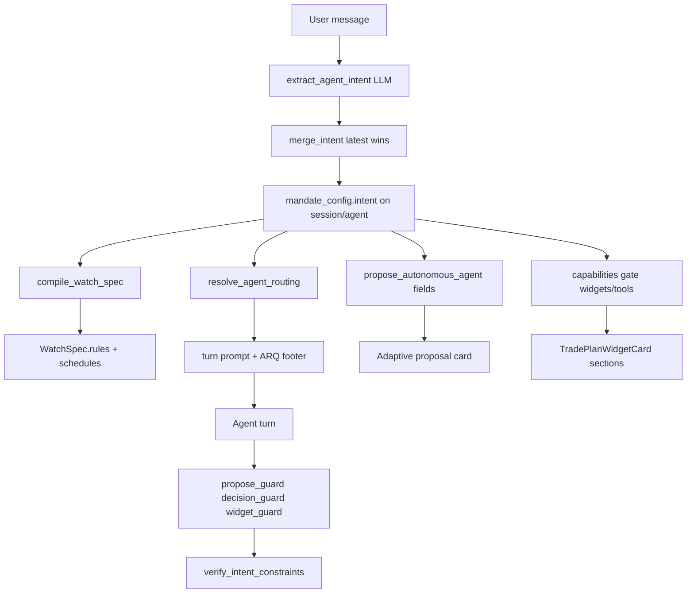

# Autonomous Agent Intent — Unified System Plan (Index)

> **For agentic workers:** REQUIRED SUB-SKILL: Use superpowers:subagent-driven-development (recommended) or superpowers:executing-plans to implement this plan task-by-task.

**Goal:** One universal intent system for autonomous agents — orchestrator create, running-agent chat, watch rules, widgets, and strategy routing — driven by an LLM structured classifier with **latest-message override**, code enforcement, and dead-surface removal. No parallel regex stacks, no asset-class-specific handling forks.

**Architecture:** Evolve [`MandateConfig`](integrations/trade_integrations/autonomous_agents/mandate_config.py) into the **single persisted authority** (`AgentIntentProfile` stored as `mandate_config.intent` + existing mandate fields). Every user message runs `extract_agent_intent()` — a **structured LLM extractor** (JSON schema + validator) that outputs a delta; merge policy is **latest explicit message wins**. Watch conditions compile to canonical [`WatchSpec`](integrations/nautilus_openalgo_bridge/models.py) rules (time cadence in `schedules`, value/group thresholds in `rules`). Prompts reinforce but never replace: propose guard, mandate enforcer, widget presentability, and schema validation are mandatory mitigations.

**Tech Stack:** Vibe `AgentLoop`, structured LLM extraction (pattern from [`extractor.py`](integrations/trade_integrations/dataflows/index_research/external_predictions/extractor.py)), `MandateConfig`, `WatchRule`, `routing_context.py`, `AutonomousAgentProposalCard.tsx`.

## Global Constraints

- Orchestrator **never executes trades** — propose only; commit is UI-only.
- OpenAlgo = execution authority; Nautilus = watch rule evaluation (India).
- **One profile, one merge path, one compiler** — no second `UserRequirementProfile`, no parallel `widget_intent` fork for autonomous sessions.
- **Latest user message overrides** prior intent for any field the message explicitly addresses; unspecified fields inherit from prior profile.
- **Instrument types are unified:** `equity | options | futures | index` — same handling pipeline; strategy/advisor routing picks the skill, not separate code paths.
- **Prompt-only fixes are insufficient** — every behavioral requirement must have a code gate (see Mitigation stack).
- No new summary docs beyond this plan set and its phase subplans.

---

## Why the previous plan was insufficient

| Gap in v1 plan | User feedback | v2 response |
|----------------|---------------|-------------|
| Regex-first classifier | LLM handles phrasing better | Structured LLM extractor primary; regex only as fast-path cache |
| `interval_only` watch_spec | User wants real conditions (time, values, groups) | LLM compiles `watch_conditions[]` → `WatchSpec`; cadence ≠ empty rules |
| Separate `UserRequirementProfile` | Multiple things for agent to handle | Extend `MandateConfig` / single `intent` block |
| Futures out of scope | Same universal design | Add `futures` to allowed instrument enum + routing |
| Phase-per-symptom fixes | Want unification + dead surface reduction | Migrate-then-delete parallel intent modules |

---

## Issue registry

| ID | Symptom | Root cause | Fixed by |
|----|---------|------------|----------|
| R1 | Defaults to options on index | `_should_default_index_options`, `allowed_instruments` default `["options"]` | Phase 2: delete default; LLM + incomplete proposal |
| R2 | "Watch NIFTY" → trading agent | Fragmented regex in `detect_observe_intent`, `orchestrator_intent`, `_TRADING_GOAL_RE` | Phase 1: unified LLM extract + merge |
| R3 | Proposal card wrong fields | Card not driven by intent profile | Phase 4 |
| R4 | Options widgets without ask | `options_advisor_autonomous`, bootstrap options workflow | Phase 5: `capabilities` from intent |
| R5 | Proposal card missing | LLM skips tool; guard gaps | Phase 4: guard + intent-driven auto-propose |
| R6 | "3 min watch" → 0.5% rule | Default `to_watch_spec()` injects spot_move; bootstrap overwrites user rules | Phase 3: intent compiler; no silent defaults |
| R7 | Intent frozen after commit | No per-message refresh | Phase 1 merge on every message |
| R8 | Too many dead surfaces | 6+ parallel intent parsers | Phase 6 migration gate |

---

## Unified data model

Store inside `mandate_config` (backward compatible — add `intent` sub-object):

```python
# integrations/trade_integrations/autonomous_agents/intent_schema.py

EngagementMode = Literal["observe", "trade"]  # watch/report vs autonomous trading
InstrumentClass = Literal["equity", "options", "futures", "index"]

@dataclass
class WatchCondition:
    """User-facing condition — compiled to WatchRule(s)."""
    kind: Literal["schedule", "price_level", "price_move", "volume", "oi", "vix", "composite"]
    symbol: str
    params: dict[str, Any]  # e.g. {"every_min": 3} | {"above": 24500} | {"pct": 0.5, "direction": "up"}
    label: str | None = None

@dataclass
class AgentIntent:
    engagement: EngagementMode
    instruments: list[InstrumentClass]   # what user wants agent to strategize on
    symbols: list[str]
    schedules: dict[str, int]            # watch_ms, research_ms
    watch_conditions: list[WatchCondition]
    capabilities: dict[str, bool]        # widgets, payoff, charges, execution — derived + overridable
    confidence_threshold: int
    constraints: dict[str, Any]        # budget, max_loss, mode paper/live
    clarified: dict[str, bool]           # which fields user explicitly stated
    source_message_id: str
    updated_at: str
```

**Merge rule (latest message wins):**

```
merged = prior.copy()
for field in extractor_delta.explicit_fields:
    merged[field] = delta[field]
    merged.clarified[field] = True
merged.capabilities = derive_capabilities(merged)  # recompute after merge
```

**Derive capabilities (code, not LLM):**

| engagement | instruments | widgets | payoff | execution |
|------------|-------------|---------|--------|-----------|
| observe | any | false | false | false |
| trade | options | true | true | when confident |
| trade | equity/futures | true | false* | when confident |
| trade | index only | outlook only | false | false until user asks F&O |

\* stock trade widgets show charges, not options payoff chart.

---

## Mitigation stack (prompt-only is NOT enough)

Every requirement has **three layers**:

| Layer | Mechanism | Example |
|-------|-----------|---------|
| **1. Extract** | LLM JSON schema + validator + retry | `extract_agent_intent(message, prior)` |
| **2. Enforce** | Code gates before side effects | `mandate_enforcer`, `is_widget_presentable`, propose `status=incomplete` |
| **3. Reinforce** | ARQ checklist in turn footer | "Did you call propose_autonomous_agent? engagement=?" |

**Constraint verification (AGENTIF-style):** After propose/commit/turn, run `verify_intent_constraints(profile, artifact)` — block-level checks with pass/fail per field.

**Clarification (EVPI-style):** When extractor returns `needs_clarification: ["instruments"]` with high ambiguity, proposal stays `incomplete` — one question, no silent defaults.

---

## System flow (unified)



---

## Phase map

| Phase | Subplan | Type | Depends | Delivers |
|-------|---------|------|---------|----------|
| 1 | [`2026-07-24-autonomous-intent-phase-1-extractor.md`](2026-07-24-autonomous-intent-phase-1-extractor.md) | implement | — | LLM extractor, merge, persist |
| 2 | [`2026-07-24-autonomous-intent-phase-2-mandate-unify.md`](2026-07-24-autonomous-intent-phase-2-mandate-unify.md) | refactor | 1 | MandateConfig intent block, delete silent defaults |
| 3 | [`2026-07-24-autonomous-intent-phase-3-watch-compiler.md`](2026-07-24-autonomous-intent-phase-3-watch-compiler.md) | implement | 1 | WatchCondition → WatchSpec compiler |
| 4 | [`2026-07-24-autonomous-intent-phase-4-proposal-card.md`](2026-07-24-autonomous-intent-phase-4-proposal-card.md) | implement | 1,2 | Card + propose guard from intent |
| 5 | [`2026-07-24-autonomous-intent-phase-5-capabilities-ui.md`](2026-07-24-autonomous-intent-phase-5-capabilities-ui.md) | implement | 1,2 | Widget/tool gating, routing |
| 6 | [`2026-07-24-autonomous-intent-phase-6-dead-surface-cleanup.md`](2026-07-24-autonomous-intent-phase-6-dead-surface-cleanup.md) | migrate | 1–5 | Remove parallel intent modules |

---

## Phase summaries

### Phase 1 — LLM intent extractor + per-message merge

**New:** `integrations/trade_integrations/autonomous_agents/intent_extractor.py`

- [ ] JSON schema for `AgentIntent` delta (explicit fields list + `needs_clarification`)
- [ ] LLM call with prior profile + latest message; pattern: structured extract + validate + ≤2 retries ([`extractor.py`](integrations/trade_integrations/dataflows/index_research/external_predictions/extractor.py))
- [ ] `merge_agent_intent(prior, delta)` — **latest message overrides** explicit fields only
- [ ] Hook: orchestrator turn end, autonomous user message, auto-propose fallback — **same function**
- [ ] Fast-path cache: trivial regex hits (optional) → skip LLM when confidence=1.0
- [ ] Persist: `session.config.mandate_config.intent` + `agent.mandate_config.intent`
- [ ] Tests: golden messages including "watch NIFTY 50 index", "every 3 minutes", "alert above 24500 and below 24000", "now do options", futures mention

### Phase 2 — Unify MandateConfig (no parallel profile)

- [ ] Add `intent: AgentIntent` to `MandateConfig.to_dict()` / `from_dict()`
- [ ] `resolve_mandate_config()` reads intent → maps to legacy fields (`agent_mode`, `allowed_instruments`, `alert_rules`) for backward compat during migration
- [ ] Extend `allowed_instruments` / routing to include **`futures`** and **`index`** as strategy targets ([`routing_context.py`](integrations/trade_integrations/execution/routing_context.py))
- [ ] **Delete** `_should_default_index_options()` — ambiguous instruments → `needs_clarification` or `incomplete`
- [ ] **Delete** silent `alert_spot_move_pct=0.5` when user supplied watch_conditions without move thresholds
- [ ] Map `engagement=observe` → `max_open_positions=0`, `revision_policy=user_guidance_only`

### Phase 3 — Watch condition compiler (LLM → WatchSpec)

**New:** `integrations/trade_integrations/autonomous_agents/watch_compiler.py`

- [ ] Map `WatchCondition` kinds to [`WatchMetric`](integrations/nautilus_openalgo_bridge/models.py): `price_move→spot_move_pct`, `price_level→level_above/below`, `volume→volume_spike_pct`, `oi→oi_change_pct`, `vix→level_above/below`
- [ ] `schedule` kind → `schedules.watch_ms` only (not a Nautilus rule)
- [ ] `composite` → multiple `WatchRule` rows (user "group of values")
- [ ] LLM may emit natural-language conditions → extractor normalizes to `WatchCondition[]` → compiler validates
- [ ] Bootstrap / `set_agent_watch_spec`: **user intent conditions win**; strategy_watch_spec applies only after trade strategy chosen AND user did not specify custom conditions
- [ ] No "interval-only empty rules" — if user only said cadence, LLM should ask "alert on what?" OR user accepts observe polling with conditions TBD (incomplete until clarified)

### Phase 4 — Proposal card + propose reliability

- [ ] Card renders from `proposal.mandate_config.intent` (not scattered fields)
- [ ] Adaptive sections: observe hides budget/execution; trade shows full; incomplete shows clarifier
- [ ] **Watch section:** cadence + human-readable condition list from `watch_conditions`
- [ ] Auto-propose + guard call `extract_agent_intent` then `propose_autonomous_agent` with compiled fields
- [ ] ARQ footer: mandatory checklist before orchestrator turn ends
- [ ] Emit `incomplete` cards with clarifying prompt

### Phase 5 — Capabilities-driven UI + tools

- [ ] Replace `options_advisor_autonomous` flag with `intent.capabilities`
- [ ] `hub_bridge`, `widget_guard`, `presentability`, `mandate_enforcer` read `capabilities` — one gate function: `assert_capabilities_allow(action, intent)`
- [ ] Tool registry filter for running agent: strip widget/execute tools when `capabilities.execution=false`
- [ ] Frontend `TradePlanWidgetCard`: show payoff/charges/index chart from `capabilities` not asset alone
- [ ] Per-message refresh: user says "I want options trading" → merge updates instruments + capabilities → toast + re-route

### Phase 6 — Dead surface cleanup (migration gate)

**Migrate callers then delete:**

| Dead surface | Replacement | Delete when |
|--------------|-------------|-------------|
| `detect_observe_intent()` standalone calls | `intent.engagement` | grep-clean + tests |
| `orchestrator_intent` regex mandate inference | `extract_agent_intent` + thin symbol/amount parsers | grep-clean |
| `parse_mandate_from_text()` heuristics | LLM extractor | grep-clean |
| `classify_widget_intent()` for autonomous sessions | `intent.capabilities` | grep-clean |
| `_should_default_index_options` | removed in phase 2 | immediate |
| Duplicate observe/trade footers | single `[agent_intent]` block in turns | grep-clean |
| `strategy_watch_spec` default 0.5% when user conditions exist | watch_compiler precedence | grep-clean |

**Keep (thin):** symbol extraction (`symbol_extract.py`), amount regex (`_AMOUNT_RE`), market hints — mechanical parsing only, not engagement/instrument decisions.

---

## Verification protocol

```bash
python -m pytest tests/test_agent_intent_extractor.py tests/test_watch_compiler.py \
  tests/test_orchestrator_intent.py tests/test_mandate_config.py \
  tests/test_orchestrator_propose_guard.py tests/test_autonomous_turns.py \
  tests/test_proposal_preflight.py -q --timeout=120
```

**Acceptance scenarios:**

1. "Watch NIFTY 50 index" → `engagement=observe`, no widgets, proposal card without budget, Confirm OK
2. "Poll every 3 minutes; alert when NIFTY moves 50 points" → `watch_ms=180000` + compiled spot_move rule from 50 pts
3. "Alert above 24500 and below 24000" → two `level_above`/`level_below` rules
4. "Create agent for NIFTY futures swing" → `instruments=["futures"]`, same propose path as options
5. After commit, no payoff widget; user says "show me options straddle" → capabilities flip, widget appears
6. Orchestrator prose-only turn → guard extracts intent + auto-proposes card

**Convergence:** fix-review-before-stack min 2 rounds per phase; program gate 3 rounds after Phase 6.

---

## What this reduces

- **6 intent systems → 1** (LLM extract + merge + compile)
- **3 watch builders → 1** (watch_compiler with strategy overlay only when appropriate)
- **2 widget intent paths → 1** (capabilities on intent)
- **Prompt-only policy drift → code gates** on every side effect
- **Asset-class forks → typed `instruments[]`** with shared routing resolver
