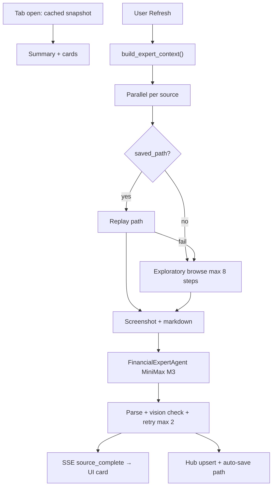

# External Predictions Financial Expert Agent — Design Spec

**Date:** 2026-07-23  
**Status:** Approved for implementation  
**Surface:** Vibe Trading `/prediction` → Miscellaneous (external-predictions)

## Goal

Replace the crawl-only street-forecast pipeline with an accuracy-first, user-initiated agent that discovers, navigates, visually verifies, and extracts third-party NIFTY 50 index forecasts — with learned navigation paths and a dedicated financial expert context store.

## Global constraints

- **Self-hosted:** Crawl4AI + Playwright + MiniMax M3 + SearXNG; no Firecrawl/managed crawl APIs.
- **User-initiated only:** No scheduled cron refresh; user clicks **Refresh** on Miscellaneous tab.
- **OpenAlgo authority unchanged:** Street forecasts are display-only; do not feed quant combiner/debate merge.
- **Structured output:** `ExternalPredictionRecord` JSON in hub store; not chat-only prose.
- **India context:** `india_trading_date_iso()` for recency; NIFTY 50 index levels only (15k–35k band).
- **MiniMax token cost:** Accepted; optimize image size for M3 input spec only.
- **Path scope:** Per `(source_id, horizon_days)`.
- **Screenshot:** Full-page capture stored locally; resize to **512×512 or 1024×1024** for M3 API; thumbnail on UI card.

## Architecture



## Components

### 1. Financial Expert Context Store

**Module:** `integrations/trade_integrations/dataflows/index_research/external_predictions/financial_expert_context.py`

**Artifact:** `reports/hub/NIFTY/external_predictions/expert_context.json`

**Built from (reuse, no fork):**

| Section | Source |
|---------|--------|
| `as_of`, `horizon_days` | India trading date + UI horizon |
| `spot` | `spot_fetch.fetch_index_spot()` |
| `internal_forecast` | `index_research/latest.json` (disambiguation only) |
| `factor_playbook` | `knowledge/factor_playbook.yaml` (subset: top movers) |
| `strategy_playbook` | `knowledge/strategy_playbook.yaml` (active regime) |
| `interpretation` | `knowledge/interpret.build_index_interpretation_bundle()` |
| `news_themes` | Hub news distillation / market context |
| `constituent_pulse` | Batch constituents summary |
| `expert_brief` | `knowledge/nifty_expert_brief.md` |
| `extraction_rules` | NIFTY-only, horizon language, reject single-stock |

**Optional v2:** `reports/hub/NIFTY/external_predictions/expert_docs/*.md` merged on build.

### 2. Financial Expert Agent (headless)

**Module:** `financial_expert_agent.py`

Orchestrator in refresh worker — not a Vibe chat session.

**Inputs per turn:** `expert_context.json`, URL, markdown, resized screenshot(s), navigation history, validator errors (on retry).

**Outputs:** `ExternalPredictionRecord`, optional browse actions, `NavigationTrace`.

**Model:** MiniMax M3 multimodal via extended client in `news_distillation` / `nse_browser/minimax_agent`.

### 3. Discovery (parallel)

- SearXNG (`fetcher.py`)
- Web search (headless `web_search_tool`)
- Curated URLs + link scoring (`crawl4ai_fetcher.py`)
- Merge, dedupe, rank by recency + relevance; top 5–8 candidates

### 4. Path routing

**Keys:** `(source_id, horizon_days)`

| Mode | When |
|------|------|
| Fast | `saved_path` exists → replay Playwright steps |
| Exploratory | No path or replay failure → agent browse max 8 steps |
| Auto-save | Successful exploratory run → `saved_path` with `approved_by: "auto"` |
| User approve | Promotes to `approved_path` with `approved_by: "user"` |

Replay failure marks path `stale` and falls back to exploratory without blocking other sources.

### 5. Screenshot pipeline

1. Crawl4AI full-page → `sources/{id}/artifacts/{run_id}/screenshot.jpg`
2. Resize for M3: max dimension 1024 (fallback 512); JPEG ~80; tile vertically if needed
3. Thumbnail for UI: ~240px wide derivative
4. Vision cross-check: "Does image support extracted target and date?"

### 6. Validation + retry

```
extract → validate_record() → vision_cross_check()
  ok → persist
  fail → retry with errors (max 2) → not_found + trace
```

**Horizon:** Do not hide predictions when article horizon ≠ tab horizon. Set `horizon_match: false`; chart uses extracted `target_date`.

### 7. SSE events (incremental UI)

| Event | Payload |
|-------|---------|
| `source_started` | `{ source_id }` |
| `source_log` | `{ source_id, message }` |
| `source_complete` | `{ source_id, record, thumbnail_url? }` |
| `job_complete` | `{ snapshot }` |

UI renders each card on `source_complete`; summary header updates incrementally.

### 8. Source registry extensions

`ExternalPredictionSource` fields:

- `entry_urls: list[str]` — required for user-added sources
- `saved_paths: dict[str, NavigationTrace]` — keyed by `str(horizon_days)`
- `approved_paths: dict[str, NavigationTrace]` — user-promoted

**Add site API:** display_name, kind, domains, entry_urls, search_queries.

### 9. Cron removal

Remove `nifty-external-predictions-refresh` from `register_default_index_jobs`. Keep user-triggered async job in `external_predictions_run_jobs.py`.

Cache TTL (`EXTERNAL_PREDICTIONS_CACHE_TTL_HOURS`) = stale badge only; never auto-fetch.

## UI contract

**On load:** Cached snapshot + summary header (spot, horizon, source count, target range, `fetched_at`).

**On Refresh:** Progress log; cards stream in per source.

**Per card:** target, direction, `target_date`, horizon badge, rationale, **screenshot thumbnail**, source URL, step trace, Approve button.

## OSS survey conclusion

No drop-in self-hosted NIFTY expert agent. Build from Trade playbooks + `nifty_expert_brief.md`. FinGPT-NSE RAG layout is reference only.

## Out of scope (v1)

- Vibe chat skill `street-forecasts-advisor`
- Feeding street forecasts into quant combiner
- Multi-index support beyond NIFTY

## Success criteria

1. No cron registers external predictions refresh.
2. Tab open loads cache without fetch.
3. Refresh streams cards per source before job ends.
4. `expert_context.json` rebuilds on refresh start.
5. Fast path → exploratory fallback on replay failure.
6. User can add site with domain + entry URLs.
7. Cards show screenshot thumbnail + link + extracted date on chart.
